# Product Requirements Document: Nexus-Affiliate Platform
## **🤖 AUTOMATION-WITH-APPROVAL EDITION**

**Version:** 4.1 (n8n-First with Human Approval Gates)  
**Date:** January 28, 2026  
**Focus:** Automate Everything → Humans Approve → Publish  
**Target:** Maximum Automation, Minimum Manual Work, Quality Guaranteed

---

## Executive Summary

### Vision
Build an **n8n-powered automation platform** that handles ALL heavy lifting (trend discovery, content generation, image creation, SEO optimization) but keeps **humans in the approval loop** at critical decision points. This ensures quality while eliminating 90% of manual work.

### Automation-With-Approval Philosophy
- **n8n automates:** Trend discovery, research, writing, images, SEO, social posts, analytics
- **Humans approve:** Topic selection, final content quality, publish decision
- **Gradual trust:** Start with 100% human approval → reduce to 20% spot checks → 5% audits

### Phased Approval Reduction
- **Phase 0 (Weeks 1-4):** Setup automation + approval workflow (100% approval rate)
- **Phase 1 (Weeks 5-12):** Every article human-reviewed before publish (100% approval)
- **Phase 2 (Weeks 13-24):** Spot check 20% of articles, auto-publish 80%
- **Phase 3 (Months 7-12):** Audit 5% randomly, auto-publish 95%

### Key Differentiators
- **n8n from Day 1:** Automation starts immediately, no manual content creation
- **Approval Gates:** Human checkpoints prevent AI mistakes from going live
- **Budget-Conscious:** $250-300/month all-in (includes n8n, APIs, hosting)
- **Legally Compliant:** FTC, GDPR, content liability addressed from start
- **Multi-LLM Strategy:** Gemini Pro primary, Claude fallback for quality
- **Risk-Managed:** Comprehensive failure scenarios and rollback plans

### Automation-Approval Flow
```
n8n: Trend Discovery → Human: Approve 3 topics → n8n: Generate content
    ↓
n8n: Quality check → Human: Review & edit draft → Human: Approve publish
    ↓
n8n: Create images + SEO + social posts → Human: Approve social posts
    ↓
n8n: Publish article → n8n: Schedule social → n8n: Track analytics
    ↓
[LOOP: Gradual reduction of human approval as quality improves]
```

---

## 1. Phased Implementation Strategy

### 1.1 Phase 0: Automation Setup (Weeks 1-4) - BUILD THE MACHINE

> **FOCUS:** Build n8n workflows that do 90% of work, you do 10% (approve & publish)

**Goals:**
- Setup n8n infrastructure with 8 core workflows
- Implement human approval gates at critical points
- Create approval dashboard/interface
- Publish first 10-15 articles (automated creation, human approval)
- Validate automation quality before scaling

**Activities:**
- Deploy n8n (self-hosted or cloud)
- Build 8 workflows with approval nodes
- Setup Supabase database
- Create approval interface (simple admin panel)
- Test full automation flow (trend → approve → generate → approve → publish)
- Join 3-5 affiliate programs
- Setup legal pages (automated templates + human review)

**Success Criteria (Gate to Phase 1):**
- [ ] All 8 n8n workflows operational
- [ ] 10-15 articles published (automated + approved)
- [ ] Approval workflow taking <30 min per article
- [ ] First affiliate click tracked
- [ ] Legal compliance reviewed by lawyer
- [ ] Quality score of automated content: 70+

**Budget:** $250-300/month (n8n, Gemini API, hosting, tools)

**Time Investment:** 60-80 hours setup (one-time), then 2-3 hours/day approvals

---

### 1.2 Technology Stack (Automation-First, Budget-Optimized)

| Layer | Phase 0-1 | Phase 2+ | Monthly Cost |
|-------|-----------|----------|--------------|  
| **Automation Engine** | n8n Cloud Starter | n8n Self-hosted (VPS) | $20 → $10 |
| **Hosting** | Vercel Free | Vercel Pro | $0 → $20 |
| **Database** | Supabase Free (500MB) | Supabase Pro | $0 → $25 |
| **AI Primary** | Gemini Pro API | Gemini Pro + Flash | $50 → $100 |
| **AI Fallback** | Claude 3.5 Sonnet (20%) | Claude + GPT-4o | $20 → $50 |
| **Web Scraping** | Firecrawl API | Firecrawl + Apify | $30 → $50 |
| **Image Generation** | Replicate (Flux.1) | Replicate + DALL-E | $20 → $40 |
| **Social Publishing** | Ayrshare Basic | Ayrshare Pro | $29 → $49 |
| **Email** | MailerLite Free | Resend | $0 → $20 |
| **Analytics** | Plausible/Umami (self-hosted) | Mixpanel + Plausible | $0 → $25 |
| **Monitoring** | BetterUptime Free | BetterUptime Pro | $0 → $10 |
| **CDN** | Vercel (included) | Cloudflare Pro | $0 → $20 |
| **Approval Interface** | Supabase Admin | Custom Next.js dashboard | $0 → $0 |
| **Total** | **~$250/mo** | **~$450/mo** | Scales with revenue |

**Why n8n from Day 1:**
- One-time setup cost (60-80 hours)
- Then saves 20+ hours/week on content production
- ROI within 3-4 weeks even if you value your time at just $15/hour
- Scales from 3 articles/week to 30 articles/week without more work
| **Hosting** | Vercel Free | Vercel Free | Vercel Pro | $0 → $20 |
| **Database** | Supabase Free | Supabase Free | Supabase Pro | $0 → $25 |
| **CMS** | Markdown files | Notion (free) | Supabase CMS | $0 |
| **AI Assistant** | Gemini Pro API | Gemini Pro | Gemini + Claude fallback | $20 → $100 |
| **Analytics** | Plausible (self-hosted) | Plausible | Plausible + Mixpanel | $0 → $19 |
| **Email** | MailerLite Free | MailerLite | Resend | $0 → $10 |
| **Automation** | Manual + scripts | n8n Cloud Starter | n8n Self-hosted | $0 → $20 → $10 |
| **Image Gen** | Skip (use stock) | Replicate ($5 credit) | Replicate/DALL-E | $0 → $30 |
| **Social** | Manual Buffer | Ayrshare Basic | Ayrshare Pro | $0 → $29 |
| **Monitoring** | Uptime Robot Free | Better Uptime | Better Uptime Pro | $0 → $10 |
| **CDN** | Vercel (included) | Vercel | Cloudflare Pro | $0 → $20 |
| **Total** | **~$150/mo** | **~$250/mo** | **~$400/mo** | Scale with revenue |

### 1.3 Core Workflows (8 Workflows with Approval Gates)

> [!IMPORTANT]
> **START WITH 8 WORKFLOWS** - Each includes human approval nodes at critical points

**Workflow Architecture:**

```mermaid
graph TB
    subgraph "Discovery & Planning (WF1-2)"
        WF1[🔍 WF1: Trend Discovery<br/>Daily + Manual]
        WF2[📄 WF2: Topic Approval<br/>Human Decision Point]
    end
    
    subgraph "Content Creation (WF3-4)"
        WF3[✍️ WF3: Content Generator<br/>Fully Automated]
        WF4[👁️ WF4: Human Review & Approval<br/>Human Decision Point]
    end
    
    subgraph "Assets & Optimization (WF5-6)"
        WF5[🎨 WF5: Asset Creator<br/>Auto after WF4 approval]
        WF6[🔧 WF6: SEO & Schema<br/>Fully Automated]
    end
    
    subgraph "Publishing & Distribution (WF7-8)"
        WF7[🚀 WF7: Publisher<br/>Auto after approval]
        WF8[📱 WF8: Social Distributor<br/>Auto-schedule]
    end
    
    WF1 -->|Suggests 10 topics| WF2
    WF2 -->|Human picks 3| WF3
    WF3 -->|Draft ready| WF4
    WF4 -->|Approved| WF5
    WF4 -->|Rejected| WF3
    WF5 --> WF6
    WF6 --> WF7
    WF7 --> WF8
    WF8 -->|Feedback loop| WF1
```



**Approval Decision Points:**
1. **WF2:** Human picks which topics to write (10 suggested → pick 3)
2. **WF4:** Human reviews article, edits if needed, approves to publish

**Phase Progression:**
- **Phase 0-1:** 100% of articles go through WF4 (human review)
- **Phase 2:** Only 20% go through WF4 (random spot checks)
- **Phase 3:** Only 5% go through WF4 (quality audits)

---

**Detailed Workflow Breakdown:**

### WF1: Trend Discovery (Automated Daily)
- Polls Google Trends, Product Hunt, Reddit, Twitter
- AI scores each trend for affiliate potential (0-100)
- Generates 10 article ideas with keywords
- Stores in Supabase with "pending_approval" status

### WF2: Topic Approval (Human Interface)
- Daily email: "10 new topic ideas ready for review"
- You open approval dashboard
- Review AI's analysis for each topic
- Click "Approve" on 2-3 topics
- Takes 10-15 minutes per day

### WF3: Content Generator (Automated)
- Triggers when topic approved
- Scrapes top 3 competitors
- AI generates outline → full article → meta tags → FAQ
- Runs quality checks (readability, keyword density)
- Stores draft with "pending_review" status
- Sends notification: "New draft ready for review"

### WF4: Human Review & Approval (Human Interface)
- You open article in approval dashboard
- AI highlights: quality score, flagged issues, suggested edits
- You read/edit the article (15-30 min)
- Click "Approve" or "Reject with feedback"
- If approved, triggers WF5-8 automatically

### WF5: Asset Creator (Automated)
- Generates 4 images (hero, social 1:1, 16:9, 9:16)
- Creates comparison tables
- Optimizes images
- Uploads to CDN

### WF6: SEO & Schema (Automated)
- Generates schema.org markup
- Creates internal links
- Optimizes meta tags
- Submits to Google/Bing indexing APIs

### WF7: Publisher (Automated)
- Publishes article to live site
- Triggers Vercel deployment
- Verifies article is live
- Updates database status

### WF8: Social Distributor (Automated)
- Waits 1 hour (for indexing)
- Generates platform-specific posts
- Schedules posts via Ayrshare
- Tracks social engagement

---

## 3. Detailed Workflow Specifications with Approval Gates

### 🔍 Workflow 1: Trend Discovery (Automated Daily)

**Trigger:** Schedule (Daily 6am) + Manual button  
**Purpose:** Auto-discover trending topics with affiliate potential  
**Automation Level:** 100% (no human intervention)  
**Cost:** ~$1/run

**Node Flow:**
```
[Schedule: Daily 6am OR Manual Trigger] 
→ [HTTP: Google Trends API - Top 20 trends (US)] 
→ [HTTP: Product Hunt API - Top 10 launches] 
→ [HTTP: Reddit API - r/technology top 10 posts] 
→ [Code: Merge & deduplicate all sources] 

→ [Loop: For each trend]
  → [Gemini Pro: Score affiliate viability]
     Prompt: "Analyze this trend for affiliate potential..."
  → [HTTP: Keywords Everywhere API - Get search volume]
  → [Code: Calculate opportunity score = (viability × volume) / 100]
→ [End Loop]

→ [Code: Sort by opportunity score]
→ [Code: Take top 10]
→ [Gemini Pro: Generate article ideas for each]
  Prompt: "For trend '{topic}', suggest:
  - Article title (SEO-optimized)
  - Target keyword
  - 3 products to review
  - Unique angle vs competitors"

→ [Supabase: Insert to content_topics table]
  status: 'pending_approval'
  metadata: {score, keyword, products, angle}

→ [Email: Send daily digest]
  To: You
  Subject: "🔥 10 Hot Topics Ready for Review"
  Body: List of topics with scores, click to approve
```

**Output:** 10 topics in approval queue, human picks 2-3 daily

**Gemini Viability Prompt:**
```
Analyze this trend for affiliate marketing potential:

Trend: {topic}
Source: {source}  
Search Volume: {volume}
Current Top 3 Articles: {competitor_titles}

Score 0-100 based on:
1. Commercial Intent (40 pts): People buying products?
2. Commission Potential (30 pts): Good affiliate programs?
3. Competition Level (15 pts): Can we rank?
4. Trend Longevity (15 pts): Sustained vs flash?

Return JSON:
{
  "score": 0-100,
  "reasoning": "2-3 sentences",
  "suggested_products": ["product1", "product2", "product3"],
  "target_keyword": "best X for Y",
  "estimated_monthly_searches": 1000,
  "commission_rate_estimate": "5-10%"
}
```

---

### 📄 Workflow 2: Topic Approval Interface (Human Decision Point)

**Trigger:** Manual (you open dashboard daily)  
**Purpose:** Human selects which topics to produce  
**Automation Level:** 0% (pure human decision)  
**Time:** 10-15 min/day

**Approval Dashboard Design:**

```typescript
// pages/admin/topics.tsx
export default function TopicsApproval() {
  const { data: topics } = useQuery('pending-topics', 
    () => supabase
      .from('content_topics')
      .select('*')
      .eq('status', 'pending_approval')
      .order('opportunity_score', { ascending: false })
  );
  
  return (
    <div>
      <h1>Topics Awaiting Approval ({topics.length})</h1>
      
      {topics.map(topic => (
        <TopicCard key={topic.id}>
          <Badge score={topic.opportunity_score} />
          <h3>{topic.title}</h3>
          
          <MetaInfo>
            <span>🔍 Keyword: {topic.target_keyword}</span>
            <span>📈 Volume: {topic.search_volume}/mo</span>
            <span>💰 Est. Commission: {topic.commission_estimate}</span>
          </MetaInfo>
          
          <AIInsight>
            <strong>AI Analysis:</strong> {topic.reasoning}
          </AIInsight>
          
          <ProductList>
            <strong>Products to Review:</strong>
            {topic.suggested_products.map(p => <li>{p}</li>)}
          </ProductList>
          
          <Actions>
            <Button onClick={() => approveTopic(topic.id)}>
              ✅ Approve & Generate
            </Button>
            <Button variant="secondary" onClick={() => rejectTopic(topic.id)}>
              ❌ Reject
            </Button>
          </Actions>
        </TopicCard>
      ))}
    </div>
  );
}

// API handler
async function approveTopic(id) {
  // Update database
  await supabase
    .from('content_topics')
    .update({ status: 'approved', approved_at: new Date() })
    .eq('id', id);
  
  // Trigger WF3 (Content Generator) via webhook
  await fetch('https://your-n8n.com/webhook/generate-content', {
    method: 'POST',
    body: JSON.stringify({ topic_id: id })
  });
  
  toast.success('Content generation started! You\'ll be notified when ready for review.');
}
```

**User Flow:**
1. Open `/admin/topics` daily (or when email notification arrives)
2. See 10 topics ranked by opportunity score
3. Read AI's analysis for each
4. Click "Approve" on 2-3 topics
5. n8n automatically triggers WF3 for approved topics
6. Close dashboard (10 min done)

---

### ✍️ Workflow 3: Content Generator (Fully Automated)

**Trigger:** Webhook from WF2 (when topic approved)  
**Purpose:** Generate complete publish-ready article  
**Automation Level:** 100%  
**Duration:** 8-12 minutes  
**Cost:** ~$2-3/article

**Node Flow:**
```
[Webhook: Topic approved from WF2] 
→ [Receive: topic_id]
→ [Supabase: Get topic details]
→ [Supabase: Update status to 'generating']

→ [Firecrawl: Scrape top 3 ranking articles for keyword]
  (3 parallel HTTP requests)
→ [Code: Extract key points, structure, product mentions]

→ [Gemini Pro: Create detailed outline]
  Prompt: "Create outline for '{title}' targeting '{keyword}'..."
  
→ [Gemini Pro: Write introduction (500 words)]
→ [Gemini Pro: Write main sections (1500 words)]
  Uses outline from previous step
  
→ [Gemini Pro: Write conclusion + CTA (200 words)]
→ [Gemini Pro: Generate FAQ section (5 Q&As)]
→ [Gemini Pro: Write meta title + description]

→ [Code: Combine all sections into markdown]
→ [Code: Add YAML frontmatter]

→ [Quality Checks (Parallel)]:
  → [Code: Flesch-Kincaid readability score]
  → [Code: Word count (target: 2000-2500)]
  → [Code: Keyword density (max 3%)]
  → [Gemini Pro: Quality assessment (0-100 score)]
  → [Code: Check affiliate disclosure present]
  → [Code: Check comparison table exists]

→ [If: Quality score < 70]
  → [Claude 3.5: Rewrite with quality feedback]
  → [Re-run quality checks]
  → [If still < 70: Flag for manual review]

→ [Supabase: Insert article]
  status: 'pending_review'
  quality_score: {score}
  content: {markdown}
  metadata: {checks}

→ [Email: Notify human reviewer]
  Subject: "📝 New Article Ready for Review: {title}"
  Body: "Quality Score: {score}/100. Click to review."
  Link: /admin/articles/{id}
```

**Gemini Writer Prompt (Main Content):**
```
Write a comprehensive affiliate review article:

Title: {title}
Keyword: {keyword} (use naturally, max 3% density)
Outline: {generated_outline}
Competitor Research: {competitor_summaries}
Products to Review: {products}

Style Guide:
- Tone: Helpful expert, not salesy
- Use "we tested", "in our analysis" (build authority)
- Be specific: include numbers, specs, prices
- Short paragraphs (2-3 sentences max)
- Transition words between sections
- Target readability: Grade 8-10 (Flesch 60-70)

MUST INCLUDE:
1. Affiliate disclosure at top (required by FTC)
2. Comparison table (markdown format)
3. Pros/cons for each product
4. "Best Overall" recommendation
5. FAQ section (5 questions)
6. Price range mentioned
7. [Internal link suggestions] (we'll add later)

NEVER:
- Make false claims
- Use superlatives without proof ("best ever", "perfect")
- Forget affiliate disclosure
- Stuff keywords unnaturally

Return markdown with YAML frontmatter:
---
title: "{title}"
meta_description: "{150 chars}"
keyword: "{keyword}"
category: "{category}"
---

{article content}
```

---

### 👁️ Workflow 4: Human Review & Approval (Human Decision Point)

**Trigger:** Manual (you receive email notification)  
**Purpose:** Human reviews AI-generated article and approves/rejects  
**Automation Level:** 0% (pure human judgment)  
**Time:** 15-30 min per article

**Review Interface Design:**

```typescript
// pages/admin/articles/[id].tsx
export default function ArticleReview({ article }) {
  const [content, setContent] = useState(article.content);
  const [isEditing, setIsEditing] = useState(false);
  
  return (
    <ReviewLayout>
      {/* Left: Article Preview */}
      <PreviewPane>
        <QualityBadge score={article.quality_score} />
        
        {isEditing ? (
          <MarkdownEditor 
            value={content}
            onChange={setContent}
            height="80vh"
          />
        ) : (
          <ArticlePreview markdown={content} />
        )}
        
        <EditButton onClick={() => setIsEditing(!isEditing)}>
          {isEditing ? 'Preview' : 'Edit'}
        </EditButton>
      </PreviewPane>
      
      {/* Right: Quality Report + Actions */}
      <SidePanel>
        <QualityReport>
          <MetricCard>
            <Label>Quality Score</Label>
            <Score color={getScoreColor(article.quality_score)}>
              {article.quality_score}/100
            </Score>
          </MetricCard>
          
          <MetricCard>
            <Label>Readability</Label>
            <Score>{article.readability_score} (Flesch)</Score>
          </MetricCard>
          
          <MetricCard>
            <Label>Word Count</Label>
            <Score>{article.word_count} words</Score>
          </MetricCard>
          
          <MetricCard>
            <Label>Keyword Density</Label>
            <Score>{article.keyword_density}%</Score>
          </MetricCard>
        </QualityReport>
        
        <IssuesSection>
          <h3>🚩 Flagged Issues ({article.issues.length})</h3>
          {article.issues.map(issue => (
            <IssueCard severity={issue.severity}>
              <strong>{issue.type}:</strong> {issue.message}
              <Location>Line {issue.line}</Location>
            </IssueCard>
          ))}
        </IssuesSection>
        
        <ChecklistSection>
          <h3>✅ Required Elements</h3>
          <Checklist>
            <Item checked={article.checks.has_disclosure}>
              Affiliate disclosure present
            </Item>
            <Item checked={article.checks.has_comparison}>
              Comparison table included
            </Item>
            <Item checked={article.checks.has_faq}>
              FAQ section (5+ questions)
            </Item>
            <Item checked={article.checks.has_meta}>
              Meta description (150-160 chars)
            </Item>
            <Item checked={article.checks.has_images_placeholder}>
              Image placeholders marked
            </Item>
          </Checklist>
        </ChecklistSection>
        
        <ActionButtons>
          <Button 
            variant="success"
            size="large"
            onClick={() => approveArticle(article.id)}
          >
            ✅ Approve & Publish
          </Button>
          
          <Button 
            variant="warning"
            onClick={() => requestRevision(article.id)}
          >
            🔄 Request AI Revision
          </Button>
          
          <Button 
            variant="danger"
            onClick={() => rejectArticle(article.id)}
          >
            ❌ Reject
          </Button>
        </ActionButtons>
        
        <RevisionNotes>
          <textarea 
            placeholder="Add notes for AI revision (optional)"
            rows={4}
          />
        </RevisionNotes>
      </SidePanel>
    </ReviewLayout>
  );
}

// Approval handler
async function approveArticle(id) {
  await supabase
    .from('articles')
    .update({ 
      status: 'approved',
      approved_at: new Date(),
      approved_by: user.id 
    })
    .eq('id', id);
  
  // Trigger WF5-8 (Assets, SEO, Publish, Social)
  await fetch('https://your-n8n.com/webhook/publish-pipeline', {
    method: 'POST',
    body: JSON.stringify({ article_id: id })
  });
  
  toast.success('Article approved! Publishing pipeline started.');
  router.push('/admin/articles');
}
```

**Review Process:**
1. Receive email: "Article ready for review"
2. Open `/admin/articles/{id}`
3. See AI quality report on right
4. Read article in left pane
5. Click "Edit" if changes needed (minor edits)
6. Review flagged issues
7. Verify checklist items
8. Click "Approve & Publish" or "Request Revision"
9. Total time: 15-30 min per article

**Phase Progression:**
- **Phase 1 (Weeks 1-12):** Review 100% of articles
- **Phase 2 (Weeks 13-24):** Only review articles with quality score <80 (auto-approve 80+)
- **Phase 3 (Month 7+):** Random 5% spot checks, auto-approve rest

---

### 🎨 Workflow 5: Asset Creator (Automated After Approval)

**Trigger:** Webhook from WF4 (article approved)  
**Purpose:** Generate all visual assets for article  
**Automation Level:** 100%  
**Duration:** 5-8 minutes  
**Cost:** ~$1.50/article

**Node Flow:**
```
[Webhook: Article approved from WF4]
→ [Receive: article_id]
→ [Supabase: Get article title, keyword, products]

→ [Gemini Pro: Generate 4 image prompts]
  - Hero image (1200x630)
  - Social square (1080x1080)
  - Social landscape (1200x675)
  - Social vertical (1080x1920)

→ [Replicate API: Generate images (parallel)]:
  → [Flux.1 Schnell: Hero image]
  → [Flux.1 Schnell: Social square]
  → [Flux.1 Schnell: Social landscape]
  → [Flux.1 Schnell: Social vertical]

→ [Loop: For each image]
  → [Code: Optimize & compress (WebP format)]
  → [Supabase Storage: Upload to CDN]
  → [Gemini Vision: Generate alt text]
→ [End Loop]

→ [Supabase: Update article with image URLs + alt texts]
→ [Continue to WF6]
```

---

### 🔧 Workflow 6: SEO & Schema Optimizer (Automated)

**Trigger:** After WF5 completes  
**Purpose:** Add all SEO enhancements  
**Automation Level:** 100%  
**Duration:** 2-3 minutes  
**Cost:** ~$0.30/article

**Node Flow:**
```
[Triggered from WF5]

→ [Gemini Pro: Generate schema.org markup]
  - Article schema
  - Product schema (for each reviewed product)
  - FAQ schema
  - BreadcrumbList schema

→ [Gemini Pro: Suggest internal links]
  Prompt: "Suggest 3-5 internal links from our {existing_articles}"
  
→ [Code: Insert internal links into article]

→ [Code: Generate clean URL slug]
  {keyword}-review-{year}

→ [Code: Validate all SEO elements]:
  - Meta title: 50-60 chars ✓
  - Meta description: 150-155 chars ✓
  - H1 tag: keyword included ✓
  - Image alt texts: all present ✓
  - Schema markup: valid JSON-LD ✓

→ [Supabase: Update article with SEO data]
→ [Continue to WF7]
```

---

### 🚀 Workflow 7: Publisher (Automated)

**Trigger:** After WF6 completes  
**Purpose:** Deploy article to live website  
**Automation Level:** 100%  
**Duration:** 3-5 minutes  
**Cost:** $0 (Vercel free)

**Node Flow:**
```
[Triggered from WF6]

→ [Supabase: Update article status to 'published']
→ [Supabase: Set published_at = NOW()]

→ [HTTP: Trigger Vercel deployment webhook]
  POST https://api.vercel.com/v1/integrations/deploy
  (ISR: Only rebuild this article page)

→ [Wait: 90 seconds for deployment]

→ [HTTP: Ping article URL to verify live]
  GET https://yoursite.com/{slug}
  
  → [If: 404 or error]
    → [Slack: Alert admin of deployment failure]
    → [Exit]

→ [HTTP: Google Indexing API]
  POST https://indexing.googleapis.com/v3/urlNotifications:publish
  Request immediate crawl

→ [HTTP: Bing Webmaster API]
  POST https://ssl.bing.com/webmaster/api.svc/json/SubmitUrlbatch
  Submit URL for indexing

→ [Supabase: Log publication]
→ [Wait: 60 minutes (for indexing)]
→ [Continue to WF8]
```

---

### 📱 Workflow 8: Social Distributor (Automated)

**Trigger:** 60 min after WF7 (allows time for indexing)  
**Purpose:** Create and schedule social media posts  
**Automation Level:** 100% (optional approval gate available)  
**Duration:** 3-5 minutes  
**Cost:** ~$0.20/article

**Node Flow:**
```
[Wait: 60 minutes after publish]
→ [Supabase: Get article details + images]

→ [Gemini Pro: Generate platform-specific posts]
  Prompt: "Create engaging social posts for:
  - Twitter/X (280 chars, 2 hashtags)
  - LinkedIn (1300 chars, professional tone)
  - Facebook (400 chars, conversational)
  - Instagram (2200 chars, visual focus, 7 hashtags)"

→ [Ayrshare API: Schedule posts]
  Twitter: Post immediately + image (1:1)
  LinkedIn: Schedule for 9am next business day + image (1:1)
  Facebook: Schedule for 7pm today + image (16:9)
  Instagram: Schedule for 6pm today + image (1:1)

→ [Supabase: Store social post IDs + scheduled times]

→ [Email: Send summary to admin]
  "Article '{title}' published and promoted on 4 platforms"
```

**Optional Approval Gate for Social:**
- In Phase 1, add human review of social posts before scheduling
- You review 4 posts (takes 2 minutes)
- Click "Approve All" to auto-schedule
- Remove this gate in Phase 2 once quality is proven

---

## 4. Phase Timeline & Budget

### Phase 0: Automation Setup (Weeks 1-4) - BUILD THE MACHINE

**Time Investment:** 60-80 hours setup (one-time), then 2-3 hours/day for approvals

**Week 1: Infrastructure Setup**
- [ ] Register domain ($12/year)
- [ ] Deploy Next.js to Vercel (free tier)
- [ ] Setup Supabase + run database migrations
- [ ] Deploy n8n Cloud Starter ($20/mo)
- [ ] Get all API keys (Gemini, Claude, Firecrawl, Replicate, Ayrshare)
- [ ] Setup monitoring (BetterUptime free tier)

**Week 2: Core Automation Workflows**
- [ ] Build WF1 (Trend Discovery) + test daily runs
- [ ] Build WF2 (Approval Dashboard UI) + test workflow
- [ ] Build WF3 (Content Generator) + test with 3 topics
- [ ] Build WF4 (Review Interface) + test approval flow

**Week 3: Assets & Publishing**
- [ ] Build WF5 (Asset Creator) + test image generation
- [ ] Build WF6 (SEO Optimizer) + test schema markup
- [ ] Build WF7 (Publisher) + test Vercel deployments
- [ ] Build WF8 (Social Distributor) + test Ayrshare

**Week 4: Testing & Launch**
- [ ] Run full end-to-end pipeline 5 times
- [ ] Publish 10-15 articles via automation
- [ ] Join 3-5 affiliate programs
- [ ] Legal review consultation ($300-500)
- [ ] Fix bugs/optimize workflows
- [ ] Add affiliate links to articles
- [ ] Track first affiliate clicks

**Success Gate:** 10+ articles published, approval workflow taking <30 min per article, first affiliate click tracked

**Budget:**
```
MONTHLY RECURRING:
Domain: $1/mo
n8n Cloud Starter: $20/mo
Vercel: $0 (free tier)
Supabase: $0 (free tier, 500MB)
Gemini Pro API: $50/mo (~15-20 articles)
Claude API (backup): $20/mo (20% fallback)
Firecrawl API: $30/mo
Replicate API: $20/mo (images)
Ayrshare Basic: $29/mo
Analytics: $0 (self-hosted Plausible)
Monitoring: $0 (BetterUptime free)
────────────────
Monthly Total: ~$170/mo

ONE-TIME:
Legal consultation: $300-500
──────────────────
Phase 0 Total: ~$1,200-1,500
```

---

### Phase 1: Production Operation (Weeks 5-12) - SCALE CONTENT

**Goals:**
- Publish 50-60 total articles (5-7 per week)
- Approve every article (100% human review)
- Refine prompts based on quality feedback
- Hit first revenue milestones

**Daily Workflow (30-45 min/day):**
- 10 min: Approve 2-3 topics from WF1
- 30 min: Review and approve 1-2 articles from WF3
- 5 min: Check analytics dashboard

**Weekly Activities:**
- Monitor quality scores (target: 75+ average)
- Refine AI prompts if quality drifting
- Apply to additional affiliate programs
- Guest post on 1-2 related blogs (backlinks)

**Success Gate:** 50+ articles, $200+ total revenue, 1000+ visitors/month

**Budget:**
```
All Phase 0 costs: $170/mo
+ Gemini Pro (increased usage): +$30/mo
+ n8n Cloud (higher tier): +$10/mo
────────────────
Monthly Total: ~$210/mo
```

---

### Phase 2: Gradual Trust (Weeks 13-24) - REDUCE MANUAL WORK

**Goals:**
- Publish 150-200 total articles
- Auto-approve 80% (only review quality score <80)
- Reduce approval time to 30 min/day (from 45 min)
- Hit break-even on costs

**Changes:**
- WF4: Only human-review articles with quality score <80
- WF4: Auto-approve articles scoring 80+ (trusted AI)
- WF8: Remove social post approval (auto-schedule)
- Expected: 5-6 articles/week, only 1-2 need review

**Success Gate:** 150+ articles, $1,500+ total revenue, 5,000+ visitors/month

**Budget:**
```
All Phase 1 costs: $210/mo
+ Supabase Pro: +$25/mo (outgrew free tier)
+ Gemini Pro (more usage): +$30/mo
+ Ayrshare Pro: +$20/mo (more platforms)
────────────────
Monthly Total: ~$285/mo
```

---

### Phase 3: High Automation (Months 7-12) - MOSTLY AUTONOMOUS

**Goals:**
- 400+ total articles
- 95% auto-approved (only 5% random audits)
- 10+ articles/week with <1 hour/week human time
- $2,000-3,000/month revenue

**Changes:**
- WF4: Auto-approve 95%, random audit 5%
- Your time: 1-2 hours/week (monitoring only)
- Add advanced workflows (A/B testing, content refresher, competitor monitoring)

**Success Gate:** Profitable business running mostly on autopilot

**Budget:**
```
All Phase 2 costs: $285/mo
+ VPS for n8n self-hosted: +$15/mo (save $20)
+ Cloudflare Pro: +$20/mo (better CDN)
+ Mixpanel: +$25/mo (advanced analytics)
────────────────
Monthly Total: ~$325/mo
```

---

## 5. Legal & Compliance (CRITICAL - DO BEFORE LAUNCH)

**Required Actions:**

1. **Global Disclosure (Site-Wide)**
   - Add to site header/footer: "This site contains affiliate links. We earn commission on qualifying purchases."
   - Link to detailed Affiliate Disclosure page

2. **Per-Article Disclosure**
   - Every article with affiliate links MUST have disclosure at top:
     ```markdown
     > **Disclosure:** This article contains affiliate links. If you make a purchase 
     > through these links, we may earn a commission at no additional cost to you.
     ```

3. **Per-Link Disclosure (Optional but Recommended)**
   - Add `[Affiliate Link]` or `[Ad]` next to affiliate links

**Implementation:**
```typescript
// components/AffiliateDisclosure.tsx
export function AffiliateDisclosure({ inline = false }) {
  if (inline) {
    return <span className="text-xs text-gray-500 ml-1">[Affiliate Link]</span>
  }
  
  return (
    <div className="bg-blue-50 border-l-4 border-blue-500 p-4 mb-6">
      <p className="text-sm">
        <strong>Disclosure:</strong> This article contains affiliate links. 
        We may earn a commission at no cost to you. 
        <Link href="/affiliate-disclosure">Learn more</Link>
      </p>
    </div>
  )
}
```

### 2.2 GDPR Compliance (For EU Traffic)

**Required Pages:**
- [ ] Privacy Policy (covers data collection, cookies, analytics)
- [ ] Cookie Consent Banner (with opt-in for non-essential cookies)
- [ ] Data Processing Agreement (if using third-party processors)
- [ ] User Data Rights (request data, delete data, export data)

**Implementation:**
```typescript
// Use a library like @cookiehub/cookiehub or cookie-consent
import CookieConsent from 'react-cookie-consent';

<CookieConsent
  location="bottom"
  buttonText="Accept All"
  declineButtonText="Decline"
  enableDeclineButton
  cookieName="nexus-affiliate-consent"
  onAccept={() => {
    // Enable analytics only after consent
    window.gtag('consent', 'update', { analytics_storage: 'granted' });
  }}
>
  We use cookies to improve your experience. See our Privacy Policy.
</CookieConsent>
```

### 2.3 Content Liability & Risk Management

**Risks:**
- AI-generated false product claims → Consumer harm → Lawsuit
- Outdated pricing/specs → Consumer complaints
- Biased reviews → Brand retaliation

**Mitigation:**

1. **Fact-Checking Protocol (Phase 0-1):**
   - [ ] Every article manually reviewed before publish
   - [ ] Product specs verified against manufacturer site
   - [ ] Pricing checked within 24 hours of publish
   - [ ] Screenshots of sources kept for 2 years

2. **Disclaimers (Every Article Footer):**
   ```markdown
   ## Important Disclaimers
   
   - Prices and availability are accurate as of {publish_date} and may change.
   - We have not personally tested all products unless explicitly stated.
   - Always verify product details on the retailer's site before purchasing.
   - Consult professionals for advice specific to your situation.
   ```

3. **Content Insurance (Phase 2+):**
   - Recommended: Media Liability Insurance (~$500-1000/year)
   - Covers libel, copyright infringement, errors & omissions

### 2.4 Platform-Specific Policies

**Amazon Associates:**
- MUST disclose: "As an Amazon Associate I earn from qualifying purchases."
- MUST link directly to Amazon (no URL shorteners on Amazon links)
- MUST honor 24-hour cookie window for commission tracking

**Google AdSense (if used):**
- MUST have Privacy Policy
- MUST disclose cookie usage
- Cannot have more than 3 ad units per page

**Social Media (Twitter, LinkedIn, Instagram):**
- Use #ad or #sponsored hashtags for sponsored content
- FTC requires disclosure in the post itself (not just bio)

### 2.5 Pre-Launch Legal Checklist

- [ ] **Consult lawyer** (1-2 hour consultation, ~$300-500)
- [ ] Create required pages: Privacy Policy, Terms, Affiliate Disclosure
- [ ] Implement cookie consent banner
- [ ] Add per-article disclosure component
- [ ] Setup content review process (who approves before publish?)
- [ ] Purchase media liability insurance (Phase 2+)
- [ ] Register business entity (LLC recommended for liability protection)

**Estimated Legal Setup Cost:** $500-1,500 one-time

---

## 3. Detailed Implementation Specifications

### 🔍 Workflow 1: Trend Discovery (Phase 1)

**Trigger:** Manual (Weekly) → Schedule (Phase 2)  
**Purpose:** Suggest trending topics with affiliate potential  
**Automation Level:** 50% (Human approves suggestions)  
**Cost:** ~$0.50/run

**Simplified Node Flow:**
```
[Manual Trigger: Weekly] 
→ [HTTP: Google Trends API (free)] 
→ [HTTP: Product Hunt API (free)] 
→ [Gemini Pro: Analyze top 20 trends for affiliate viability] 
→ [Gemini Pro: Generate 5 article ideas with keywords] 
→ [Supabase: Insert as suggestions (status=suggested)] 
→ [Email: Send weekly report to you]
→ [Human: Reviews and approves 2-3 topics]
```

**Gemini Viability Analysis Prompt:**
```
You are an affiliate marketing analyst. Analyze these 20 trending topics and:

1. Score each 0-100 for affiliate potential:
   - Commercial Intent (40%): Can people buy something?
   - Commission Potential (30%): Are there affiliate programs?
   - Competition (15%): Can a new site rank?
   - Longevity (15%): Sustained interest vs flash trend?

2. For top 5 topics, suggest:
   - Primary keyword (search volume estimate)
   - 3 product categories to review
   - Unique angle to differentiate from competitors

Return JSON with 5 article ideas ranked by opportunity score.
```

**Output:** Weekly email with 5 curated article ideas → Human picks 2-3 to produce

**Phase 2 Enhancement:** Auto-queue top-scored topics (still human approval required)

---

### ✍️ Workflow 2: AI Content Assistant (Phase 1)

**Trigger:** Manual (You trigger after selecting topic)  
**Purpose:** Generate first draft, not final article  
**Automation Level:** 60% (AI drafts, human heavily edits)  
**Cost:** ~$1.50/article

**Node Flow:**
```
[Manual Trigger: "Generate draft for {topic}"] 
→ [Supabase: Get topic details + keywords] 
→ [Firecrawl: Scrape top 3 ranking articles (fallback: manual research)] 
→ [Gemini Pro: Create detailed outline] 
→ [Human: Approve/edit outline] 
→ [Gemini Pro: Write 2000-word first draft] 
→ [Gemini Pro: Generate meta tags + FAQ] 
→ [Supabase: Save as draft] 
→ [Trigger: WF3 Quality Check] 
→ [Open draft in Notion/editor for human revision]
```

**Gemini Outline Prompt:**
```
Create an outline for: "{article_title}"

Target Keyword: {keyword}
Top 3 Competitors: {scraped_content_summaries}

Outline Requirements:
1. Hook intro (specific problem/pain point)
2. 6-8 H2 sections covering:
   - What is {topic}? (define clearly)
   - Who needs this? (use cases)
   - Top 5-7 products comparison
   - How to choose (buying guide)
   - FAQ (5 questions)
   - Final recommendation
3. Include comparison table structure
4. Suggest internal linking opportunities

Provide unique angle to beat competitors.
Return JSON outline.
```

**Gemini Writer Prompt:**
```
Write a comprehensive article using this outline:
{outline}

Style Guide:
- Tone: Helpful expert, not salesy
- Use "we tested", "in our experience" (even if simulated)
- Include specific numbers/specs (not vague claims)
- Keep paragraphs short (2-3 sentences)
- Use transition phrases
- Target readability: Flesch score 60-70

CRITICAL:
- Add affiliate disclosure at top
- Never make false claims
- Use [VERIFY: claim] for facts to check
- Include comparison table in markdown

Return markdown with YAML frontmatter.
```

**Expected Output:** 70% complete draft that needs 30 min - 1 hour of human editing

**Phase 2 Enhancement:** Reduce human editing to 15 min via prompt refinement

---

### 🔬 Workflow 3: Quality Checker (Phase 1)

**Trigger:** After WF2 completes  
**Purpose:** Flag issues before human review  
**Automation Level:** 100% (but human still reviews flagged items)  
**Cost:** ~$0.30/article

**Node Flow:**
```
[Triggered by WF2] 
→ [Receive: article_draft] 
→ [Code: Basic checks]
   - Word count (min 1500 words)
   - Has H2 headings (min 5)
   - Has comparison table
   - Has affiliate disclosure
   - Has meta description
→ [Gemini Pro: Quality assessment]
→ [Code: Readability score (Flesch-Kincaid)]
→ [Code: Keyword density (not > 3%)]
→ [Gemini Pro: Fact-check flagging]
   - Flag claims that need verification
   - Flag outdated information
   - Flag potential false claims
→ [Supabase: Update with quality report]
→ [Email: Send quality report to human reviewer]
```

**Gemini Quality Assessment:**
```
Review this draft article for quality issues:

{article_content}

Flag:
1. Vague/generic statements ("best", "great" without specifics)
2. Claims without evidence
3. Potentially false or exaggerated claims
4. Grammar/spelling errors
5. Poor structure/flow
6. Missing key information competitors cover
7. Overly promotional language

Score 0-100 for:
- Usefulness (does it actually help readers?)
- Specificity (concrete details vs fluff)
- Trustworthiness (sounds credible?)
- Completeness (covers topic thoroughly?)

Return JSON with:
- Overall score
- Issues array (each with severity: low/medium/high)
- Strengths array
- Improvement suggestions
```

**Output:** Quality report + flagged issues for human to address

---

### 📱 Workflow 4: Social Publisher (Phase 1)

**Trigger:** Manual (after article published)  
**Purpose:** Create and schedule social media posts  
**Automation Level:** 70% (AI writes, human schedules)  
**Cost:** ~$0.20/post batch

**Node Flow:**
```
[Manual Trigger: "Create social posts for {article_slug}"] 
→ [Supabase: Get article details] 
→ [Gemini Pro: Generate platform-specific posts]
   - Twitter/X (280 chars)
   - LinkedIn (1200 chars)
   - Facebook (400 chars)
→ [Gemini Pro: Generate hashtag strategy]
→ [Supabase: Save social posts as drafts] 
→ [Human: Review and schedule in Buffer/Ayrshare]
```

**Phase 0 Alternative:** Use free Buffer (3 channels, 10 posts scheduled) → $0/month

**Phase 2 Enhancement:** Auto-schedule to Ayrshare, human spot-checks

---

### 📊 Workflow 5: Analytics Collector (Phase 1)

#### Scenario 2: Gemini Pro Quality Degrades

**Symptoms:**
- Articles becoming generic/repetitive
- Quality scores dropping (<70)
- User engagement declining
- Content reads like "AI slop"

**Root Causes:**
- Prompt fatigue (same prompts produce worse results over time)
- Gemini model updates change behavior
- Insufficient context in prompts
- Over-reliance on single LLM

**Action Plan:**
1. **Immediate (Day 1):**
   - Switch to Claude 3.5 Sonnet for next 10 articles
   - Compare quality vs cost
2. **Week 1:**
   - Refine prompts with more specific examples
   - Add "anti-patterns" to prompts (what NOT to do)
3. **Week 2:**
   - Implement multi-LLM strategy:
     ```javascript
     const generateContent = async (topic) => {
       try {
         // Try Gemini first (cheaper)
         const result = await geminiPro(topic);
         const qualityScore = await assessQuality(result);
         
         if (qualityScore < 75) {
           // Fallback to Claude for quality
           return await claudeSonnet(topic);
         }
         return result;
       } catch (error) {
         // Gemini API down? Use Claude
         return await claudeSonnet(topic);
       }
     };
     ```

**Prevention:**
- Track quality scores weekly
- Rotate between Gemini and Claude 70/30 split
- Human review 20% of articles randomly

---

#### Scenario 3: Google Algorithm Update Tanks Rankings

**Symptoms:**
- Traffic drops 40-60% overnight
- Rankings drop from page 1 to 3-5
- Google Search Console shows "de-indexing"

**Root Causes:**
- Google targets AI-generated content
- Thin content penalty
- Lack of E-E-A-T (Experience, Expertise, Authority, Trust)

**Action Plan:**
1. **Week 1:**
   - Audit top 20 articles for "AI tells"
   - Add personal experience sections ("In our testing...")
   - Add author bios with credentials
2. **Week 2:**
   - Get backlinks from real sites (guest posts, outreach)
   - Add user-generated content (comments, testimonials)
   - Refresh articles with updated data
3. **Month 2:**
   - Diversify traffic sources:
     - Email list (owned audience)
     - Reddit, Quora presence
     - YouTube videos (repurpose articles)
     - Pinterest pins (visual content)

**Prevention:**
- Don't rely 100% on SEO from day 1
- Build email list aggressively (20% of visitors should subscribe)
- Create content in multiple formats (video, infographics)
- Get real backlinks (not just auto-generated content)

---

#### Scenario 4: Affiliate Programs Reject Application

**Symptoms:**
- Amazon Associates: Rejected ("insufficient traffic")
- Impact/ShareASale: Rejected ("new site, no history")
- CJ Affiliate: Rejected ("content quality concerns")

**Root Causes:**
- Site too new (<3 months old)
- Low traffic (<1000 visitors/month)
- Thin content or obvious AI generation
- No established brand

**Action Plan:**
1. **Immediate:**
   - Apply to beginner-friendly programs first:
     - **PartnerStack** (lower barriers)
     - **FlexOffers** (accepts newer sites)
     - **Awin** (easier approval)
   - Use direct merchant programs (many SaaS companies have own programs)
2. **Month 2:**
   - Build traffic to 1000+ visitors/month
   - Add "About Us" page with team photos/bios
   - Get testimonials from users
3. **Month 3:**
   - Reapply to Amazon Associates
   - Reference your traffic growth

**Prevention:**
- Research program requirements BEFORE building site
- Some programs (software, SaaS) easier than physical products
- Consider starting with high-ticket affiliate programs (B2B software pays better)

---

#### Scenario 5: n8n Workflows Break Silently

**Symptoms:**
- No new articles for 3 days
- Analytics not updating
- No errors in logs (silent failure)

**Root Causes:**
- API rate limits reached
- Webhook not firing
- Database connection timeout
- n8n instance restarted (lost in-progress workflows)

**Action Plan:**
1. **Immediate:**
   - Manual health check:
     ```bash
     curl https://your-n8n.com/webhook/health-check
     ```
   - Check n8n UI for paused workflows
   - Check Supabase connection pool
2. **Setup Monitoring:**
   ```javascript
   // Add to every workflow
   const sendHeartbeat = async (workflowName) => {
     await fetch('https://cronitor.io/ping/YOUR_KEY', {
       method: 'POST',
       body: JSON.stringify({
         workflow: workflowName,
         timestamp: new Date().toISOString()
       })
     });
   };
   ```
3. **Implement Alerts:**
   - Use **BetterUptime** (free tier: 10 monitors)
   - Alert if workflow hasn't run in 25 hours (expected: daily)
   - Alert if error rate >10%

**Prevention:**
- Add heartbeat to every workflow
- Set up Dead Man's Switch (cronitor.io free tier)
- Weekly manual spot-checks (every Monday morning)

---

### 5.2 Multi-LLM Fallback Strategy

**Primary: Gemini Pro (75% of requests)**
- Cost: $0.00025/1K input tokens
- Use for: Drafts, outlines, social posts, analytics

**Secondary: Claude 3.5 Sonnet (20% of requests)**
- Cost: $0.003/1K input tokens (12x more expensive)
- Use for: Final quality polish, complex rewrites, fact-checking
- Trigger when: Gemini quality score <75

**Tertiary: GPT-4o (5% of requests)**
- Cost: $0.005/1K input tokens (20x more expensive)
- Use for: Structured data extraction, JSON formatting, edge cases
- Trigger when: Both Gemini and Claude fail

**Implementation:**
```typescript
// lib/ai-router.ts
export async function generateWithFallback(
  prompt: string,
  options: { quality: 'draft' | 'final', format: 'text' | 'json' }
) {
  const providers = [
    { name: 'gemini', fn: callGemini, cost: 0.00025 },
    { name: 'claude', fn: callClaude, cost: 0.003 },
    { name: 'gpt4', fn: callGPT4, cost: 0.005 }
  ];
  
  for (const provider of providers) {
    try {
      const result = await provider.fn(prompt, options);
      
      // Log for cost tracking
      await logAIUsage({
        provider: provider.name,
        cost: provider.cost * estimateTokens(prompt),
        quality: await assessQuality(result)
      });
      
      return result;
    } catch (error) {
      console.error(`${provider.name} failed, trying next...`);
      continue;
    }
  }
  
  throw new Error('All AI providers failed');
}
```

---

## 6. Database Schema (Simplified for Phase 1)

```sql
-- Phase 1: Minimum viable schema

-- Topics queue
CREATE TABLE content_topics (
  id UUID PRIMARY KEY DEFAULT gen_random_uuid(),
  title TEXT NOT NULL,
  target_keyword TEXT,
  status TEXT DEFAULT 'suggested', -- suggested, approved, in_progress, published
  priority_score DECIMAL(5,2),
  source TEXT, -- 'google_trends', 'manual', etc.
  metadata JSONB,
  created_at TIMESTAMP DEFAULT NOW(),
  published_article_id UUID
);
**Purpose:** Aggregate performance data  
**Automation Level:** 100%  
**Cost:** ~$0.10/day

**Node Flow:**
```
[Schedule: Daily 2am] 
→ [Supabase: Query affiliate_clicks (yesterday)] 
→ [Plausible API: Get pageviews per article] 
→ [Code: Calculate CTR per article] 
→ [Code: Calculate revenue per article] 
→ [Supabase: Update articles table with metrics] 
→ [Gemini Pro: Generate weekly insights (Sun only)]
→ [Email: Send weekly performance report]
```

**Weekly Report Contents:**
- Top 5 articles by traffic
- Top 5 articles by affiliate clicks
- Total revenue (by program)
- CTR trends
- Suggested articles to refresh

---

## 4. Realistic Projections & Budget

### 4.1 Traffic Projections (Conservative)

| Milestone | Timeline | Monthly Visitors | How to Achieve |
|-----------|----------|-----------------|----------------|
| **Launch** | Week 1 | 100-200 | Friends, social sharing |
| **Phase 0 End** | Week 4 | 300-500 | 20 articles indexed, initial SEO |
| **Phase 1 End** | Week 12 | 1,000-2,000 | 50 articles, some ranking page 2-3 |
| **Phase 2 End** | Week 24 | 5,000-8,000 | 150 articles, 20-30 ranking page 1 |
| **Month 9** | Month 9 | 15,000-25,000 | 300 articles, domain authority building |
| **Month 12** | Month 12 | 30,000-50,000 | 500 articles, established authority |

**Reality Check:** 
- New domains take 6-9 months to rank consistently
- Expect 80% of articles to get <100 views/month
- 15-20% of articles will drive 80% of traffic (power law)
- Buying aged domain ($500-2000) can accelerate 3-4 months

### 4.2 Revenue Projections (Conservative)

**Assumptions:**
- Affiliate CTR: 1.5% (Phase 0) → 2.5% (Phase 2)
- Average commission: $8-12 per conversion
- Conversion rate: 5-8% of clicks

| Phase | Monthly Visitors | Affiliate Clicks | Conversions | Revenue |
|-------|-----------------|------------------|-------------|----------|
| **Phase 0 (Month 1)** | 300 | 5 | 0-1 | $0-10 |
| **Phase 1 Start (Month 2)** | 800 | 12 | 1 | $10-30 |
| **Phase 1 End (Month 3)** | 2,000 | 50 | 3-4 | $50-80 |
| **Phase 2 Start (Month 4)** | 3,500 | 88 | 5-7 | $80-150 |
| **Phase 2 Mid (Month 6)** | 7,000 | 175 | 12-14 | $200-350 |
| **Phase 2 End (Month 9)** | 20,000 | 500 | 35-40 | $600-1,000 |
| **Phase 3 (Month 12)** | 40,000 | 1,000 | 70-80 | $1,500-2,500 |

**Break-Even:** Month 6-7 (revenue > costs)

### 4.3 Budget Breakdown (Minimum Spend)

**Phase 0 (Months 1-1): $150-200/month**
```
Domain: $12/year ($1/mo)
Vercel Hosting: $0 (free tier)
Supabase: $0 (free tier, 500MB database)
Gemini Pro API: $20 (for content assistance)
Plausible Analytics: $0 (self-hosted or free alternative)
Email (MailerLite): $0 (up to 1000 subscribers)
Stock Images: $0 (Unsplash, Pexels)
SSL/CDN: $0 (included with Vercel)
Misc Tools: $20
────────────────
TOTAL: ~$150/mo
```

**Phase 1 (Months 2-3): $250-300/month**
```
All Phase 0 costs: $150
n8n Cloud Starter: $20
Firecrawl API: $30 (for competitor research)
Buffer/Ayrshare: $15 (basic plan)
Replicate (images): $20 (100 images)
Uptime monitoring: $0 (free tier)
────────────────
TOTAL: ~$250/mo
```

**Phase 2 (Months 4-9): $400-500/month**
```
All Phase 1 costs: $250
Supabase Pro: $25 (need more DB)
Gemini Pro (scale): $80 (more API usage)
Ayrshare Pro: $29 (more platforms)
Cloudflare Pro: $20 (better CDN)
Better Uptime: $10
Email (Resend): $20 (more subscribers)
────────────────
TOTAL: ~$450/mo
```

**Phase 3 (Months 10-12): $600-800/month**
```
All Phase 2 costs: $450
n8n Self-hosted: $30 (VPS)
Mixpanel: $25 (advanced analytics)
Claude API (backup): $50
Content writers: $100-200 (hired help)
────────────────
TOTAL: ~$700/mo
```

**12-Month Total Cost:** ~$5,500-6,500  
**Expected 12-Month Revenue:** ~$8,000-12,000  
**Net Profit Year 1:** ~$2,000-5,500

---

## 5. Risk Management & Failure Scenarios

### 5.1 Critical Failure Scenarios

#### Scenario 1: No Affiliate Conversions After 2 Months

**Symptoms:**
- 30+ articles published
- Decent traffic (500+ visitors/month)
- Zero or <$20 in commissions

**Root Causes:**
- Wrong niche (low commercial intent)
- Poor product selection (low commission rates)
- Weak CTAs / affiliate link placement
- Trust issues (new site, thin content)

**Action Plan:**
1. **Week 1:** Analyze top 5 articles:
   - Where are users clicking?
   - Heatmap analysis (use Hotjar free tier)
   - Compare CTA placement vs competitors
2. **Week 2:** A/B test improvements:
   - Move affiliate links higher in content
   - Add comparison tables (visual boost)
   - Test different CTA copy
3. **Week 3:** If still no conversions:
   - **PIVOT:** Switch niche or product category
   - Apply to different affiliate programs (test Impact, ShareASale)
4. **Week 4:** If still failing:
   - **STOP:** Don't throw money at Phase 1
   - Validate niche demand via paid ads (Google Ads, $100 test)

**Prevention:**
- Research commission rates BEFORE writing
- Target keywords with "best", "review", "vs" (commercial intent)
- Join affiliate programs BEFORE writing (get approval first)

---

-- Articles
CREATE TABLE articles (
  id UUID PRIMARY KEY DEFAULT gen_random_uuid(),
  slug TEXT UNIQUE NOT NULL,
  title TEXT NOT NULL,
  content TEXT, -- markdown
  excerpt TEXT,
  
  -- SEO
  meta_title TEXT,
  meta_description TEXT,
  target_keyword TEXT,
  
  -- Images
  featured_image_url TEXT,
  featured_image_alt TEXT,
  
  -- Categorization
  category TEXT,
  tags TEXT[],
  
  -- AI metadata
  generated_by TEXT DEFAULT 'gemini-pro',
  quality_score DECIMAL(5,2),
  human_edited BOOLEAN DEFAULT FALSE,
  
  -- Publishing
  status TEXT DEFAULT 'draft', -- draft, scheduled, published
  published_at TIMESTAMP,
  updated_at TIMESTAMP DEFAULT NOW(),
  
  -- Performance
  total_views INTEGER DEFAULT 0,
  total_clicks INTEGER DEFAULT 0,
  ctr DECIMAL(5,2),
  
  created_at TIMESTAMP DEFAULT NOW()
);

CREATE INDEX idx_articles_slug ON articles(slug);
CREATE INDEX idx_articles_status ON articles(status);
CREATE INDEX idx_articles_published ON articles(published_at DESC);

-- Products (for comparison tables)
CREATE TABLE products (
  id UUID PRIMARY KEY DEFAULT gen_random_uuid(),
  name TEXT NOT NULL,
  brand TEXT,
  category TEXT,
  
  -- Pricing
  price DECIMAL(10,2),
  currency TEXT DEFAULT 'USD',
  
  -- Affiliate
  affiliate_url TEXT NOT NULL,
  affiliate_program TEXT, -- 'amazon', 'impact', etc.
  commission_rate DECIMAL(5,2),
  
  -- Content
  description TEXT,
  image_url TEXT,
  features JSONB,
  
  -- Performance
  total_clicks INTEGER DEFAULT 0,
  total_conversions INTEGER DEFAULT 0,
  
  created_at TIMESTAMP DEFAULT NOW(),
  updated_at TIMESTAMP DEFAULT NOW()
);

-- Affiliate clicks tracking
CREATE TABLE affiliate_clicks (
  id UUID PRIMARY KEY DEFAULT gen_random_uuid(),
  article_id UUID REFERENCES articles(id),
  product_id UUID REFERENCES products(id),
  
  clicked_at TIMESTAMP DEFAULT NOW(),
  user_id TEXT, -- anonymous fingerprint
  
  -- Attribution
  referrer TEXT,
  utm_source TEXT,
  utm_campaign TEXT,
  
  -- Conversion tracking (updated later via postback)
  converted BOOLEAN DEFAULT FALSE,
  conversion_date TIMESTAMP,
  commission_amount DECIMAL(10,2)
);

CREATE INDEX idx_clicks_article ON affiliate_clicks(article_id);
CREATE INDEX idx_clicks_date ON affiliate_clicks(clicked_at DESC);

-- Email subscribers
CREATE TABLE email_subscribers (
  id UUID PRIMARY KEY DEFAULT gen_random_uuid(),
  email TEXT UNIQUE NOT NULL,
  first_name TEXT,
  
  subscription_source TEXT, -- 'popup', 'content_upgrade'
  subscribed_at TIMESTAMP DEFAULT NOW(),
  unsubscribed_at TIMESTAMP,
  
  total_emails_opened INTEGER DEFAULT 0,
  total_links_clicked INTEGER DEFAULT 0
);

-- Workflow execution logs (for debugging)
CREATE TABLE workflow_logs (
  id UUID PRIMARY KEY DEFAULT gen_random_uuid(),
  workflow_name TEXT,
  status TEXT, -- 'success', 'failed', 'running'
  duration_ms INTEGER,
  error_message TEXT,
  metadata JSONB,
  
  executed_at TIMESTAMP DEFAULT NOW()
);

CREATE INDEX idx_logs_workflow ON workflow_logs(workflow_name);
CREATE INDEX idx_logs_executed ON workflow_logs(executed_at DESC);
```

**Phase 2 Additions:**
- A/B testing tables
- Social media posts tracking
- Email campaigns table
- More detailed analytics

---

## 7. Implementation Roadmap

### Phase 0: Manual MVP (Weeks 1-4) - Budget: $150/mo

**Week 1: Setup**
- [ ] Register domain ($12/year)
- [ ] Setup Next.js project on Vercel (free)
- [ ] Setup Supabase (free tier)
- [ ] Create required legal pages (Privacy, Terms, Affiliate Disclosure)
- [ ] Implement cookie consent banner
- [ ] Setup Plausible analytics (self-hosted or simple-analytics.com)
- [ ] Get Gemini Pro API key

**Week 2-3: Content Creation (Manual)**
- [ ] Choose SPECIFIC niche (e.g., "AI Developer Tools" not "tech")
- [ ] Research top 10 competitors
- [ ] Write 15 articles manually (or hire writer on Upwork: $30-50/article)
- [ ] Join 3-5 affiliate programs
- [ ] Add affiliate links to articles
- [ ] Create simple email signup form

**Week 4: Launch & Validate**
- [ ] Publish all 15 articles
- [ ] Submit to Google Search Console
- [ ] Share on relevant Reddit/forums (manually)
- [ ] Post to Twitter/LinkedIn (manually)
- [ ] Track: Traffic, clicks, conversions
- [ ] **GATE:** $200 in revenue OR 3,000 visitors before Phase 1

**Deliverables:**
- Live website with 15-20 quality articles
- Legally compliant (disclosures, privacy policy)
- Basic analytics working
- At least 1 affiliate conversion (proof of concept)

---

### Phase 1: AI-Assisted (Weeks 5-12) - Budget: $250/mo

**Week 5-6: Automation Foundation**
- [ ] Setup n8n Cloud Starter ($20/mo)
- [ ] Implement WF1: Trend Discovery (weekly manual trigger)
- [ ] Implement WF2: AI Content Assistant (manual trigger)
- [ ] Implement WF3: Quality Checker (auto-trigger)
- [ ] Test full workflow: Trend → Draft → Quality Check

**Week 7-9: Content Production**
- [ ] Generate 3-4 AI-assisted articles per week
- [ ] Human edits each article (30-60 min each)
- [ ] Human approves before publishing
- [ ] Track quality scores (target: 75+)
- [ ] Refine prompts based on output quality

**Week 10-11: Distribution**
- [ ] Implement WF4: Social Publisher
- [ ] Implement WF5: Analytics Collector
- [ ] Setup Buffer free account
- [ ] Create social media schedule (3x/week per platform)

**Week 12: Review & Optimize**
- [ ] Analyze 50 total articles performance
- [ ] Identify top 10% performers (write more like these)
- [ ] Identify bottom 10% (delete or rewrite)
- [ ] Calculate actual CTR and revenue per article
- [ ] **GATE:** $500 in revenue OR 8,000 visitors before Phase 2

**Deliverables:**
- 50-60 total articles (20 manual + 30-40 AI-assisted)
- 5 working n8n workflows
- Proven content creation process (<2 hours per article)
- Refined prompts that consistently produce 75+ quality scores

---

### Phase 2: Core Automation (Weeks 13-24) - Budget: $400/mo

**Week 13-16: Increase Automation**
- [ ] Reduce human editing to 15 min per article (better prompts)
- [ ] Auto-schedule social posts (human spot-checks)
- [ ] Implement WF6: Link Health Monitor
- [ ] Scale to 5-7 articles per week
- [ ] Hire part-time VA for final reviews ($10/hr, 5 hrs/week = $200/mo)

**Week 17-20: Expand Distribution**
- [ ] Implement WF7: Email Campaigner (weekly newsletter)
- [ ] Grow email list to 500+ subscribers
- [ ] Start YouTube channel (repurpose articles as videos)
- [ ] Create Pinterest account (design templates in Canva)
- [ ] Guest post on 2-3 relevant blogs (backlinks!)

**Week 21-24: Optimize Revenue**
- [ ] A/B test affiliate link placement
- [ ] Add comparison tables to top 20 articles
- [ ] Implement WF8: Content Refresher (monthly)
- [ ] Update old articles with new products
- [ ] Apply to premium affiliate programs (higher commissions)
- [ ] **GATE:** $2,000 in revenue OR 25,000 visitors before Phase 3

**Deliverables:**
- 150-200 total articles
- 8 working workflows (minimal human intervention)
- 1,000+ email subscribers
- Multiple traffic sources (not just SEO)
- Break-even or profitable

---

### Phase 3: Full Scale (Months 7-12) - Budget: $600/mo

**Goals:**
- Scale to 10+ articles per week (mostly automated)
- Reach 50,000 visitors/month
- Hit $5,000/month revenue
- Build team (writers, editors, marketers)

**Activities:**
- Implement remaining workflows (A/B testing, competitor monitoring)
- Expand to multiple niches
- Launch premium content tier (Memberful or Stripe)
- Create online course or ebook
- Attend industry conferences (networking)
- Hire full-time writer/editor

---

## 8. Success Metrics & KPIs

### Phase 0 KPIs (Weeks 1-4)
- [ ] 15+ articles published
- [ ] 3+ affiliate programs joined
- [ ] 1+ affiliate conversion (proof it works!)
- [ ] 50+ email subscribers
- [ ] 300+ total visitors
- [ ] All legal pages live

### Phase 1 KPIs (Weeks 5-12)
- [ ] 50+ total articles
- [ ] 1,500+ monthly visitors
- [ ] $500+ total revenue
- [ ] 1.5%+ affiliate CTR
- [ ] 200+ email subscribers
- [ ] 5 workflows operational
- [ ] <2 hours per article (including AI assistance)

### Phase 2 KPIs (Weeks 13-24)
- [ ] 150+ total articles
- [ ] 8,000+ monthly visitors
- [ ] $2,000+ total revenue (cumulative)
- [ ] 2.0%+ affiliate CTR
- [ ] 1,000+ email subscribers
- [ ] 8 workflows operational
- [ ] <1 hour per article (mostly automated)

### Phase 3 KPIs (Months 7-12)
- [ ] 400+ total articles
- [ ] 40,000+ monthly visitors
- [ ] $5,000+ monthly revenue (break into real profit!)
- [ ] 2.5%+ affiliate CTR
- [ ] 5,000+ email subscribers
- [ ] 20+ page 1 rankings
- [ ] Featured in industry publications

---

## 9. Critical Pre-Launch Checklist

### Legal & Compliance
- [ ] Consult lawyer (1-2 hours, $300-500) **NON-NEGOTIABLE**
- [ ] Create Privacy Policy (use Termly or iubenda generator)
- [ ] Create Terms of Service
- [ ] Create Affiliate Disclosure page
- [ ] Implement cookie consent banner (GDPR compliant)
- [ ] Add per-article affiliate disclosures
- [ ] Register business entity (LLC recommended: $100-500)

### Technical Setup
- [ ] Domain purchased and configured
- [ ] Vercel project deployed
- [ ] Supabase project created
- [ ] Database migrations run
- [ ] SSL certificate active (auto via Vercel)
- [ ] Analytics installed and tested
- [ ] Email signup form working
- [ ] Affiliate link tracking working

### Content Readiness
- [ ] 15-20 articles written and edited
- [ ] All articles have featured images
- [ ] All articles have meta tags
- [ ] All affiliate links working (click-test each one)
- [ ] Comparison tables formatted correctly
- [ ] Internal linking implemented
- [ ] Author bio/about page created

### Marketing Preparation
- [ ] Social media accounts created (Twitter, LinkedIn minimum)
- [ ] Email welcome sequence written (3-5 emails)
- [ ] Reddit/forum communities identified
- [ ] Content calendar for first month
- [ ] Email signature with site link

---

## 10. Cost-Benefit Analysis

### Total Investment Year 1
**Time:** 300-400 hours (manual work + setup)
**Money:** $5,500-6,500 (hosting, tools, legal, APIs)
**Total:** ~$8,000-12,000 (if valuing your time at $15-20/hr)

### Expected Return Year 1
**Revenue:** $8,000-12,000 (conservative)
**Email List Value:** $5-10 per subscriber × 5,000 = $25,000-50,000 asset
**Domain Authority:** 20-30 DA (worth $2,000-5,000 if sold)
**Total Assets:** ~$40,000-70,000

**ROI:** 300-700% (if including assets, not just cash)

### Break-Even Timeline
**Cash Break-Even:** Month 6-7 (cumulative revenue > cumulative costs)  
**Time Break-Even:** Month 9-12 (if valuing your time)

---

## 11. When to STOP (Cut Losses)

Don't throw good money after bad. **Stop and pivot if:**

### After Phase 0 (Week 4)
- [ ] Zero affiliate conversions after 20 articles + 1,000 visitors
- [ ] CTR < 0.5% (people not clicking your links)
- [ ] All affiliate applications rejected
- [ ] Legal consultation reveals major liability issues

**→ ACTION:** Don't proceed to Phase 1. Pivot niche or business model.

### After Phase 1 (Week 12)
- [ ] <$200 total revenue after 50 articles
- [ ] Traffic declining (not growing)
- [ ] Quality scores consistently <60 (AI not working)
- [ ] Spending 10+ hours per article (automation failed)

**→ ACTION:** Don't scale to Phase 2. Fix core issues or shut down.

### After Phase 2 (Week 24)
- [ ] <$1,000 total revenue after 150 articles
- [ ] Not break-even on costs
- [ ] Burned out (spending 40+ hours/week)
- [ ] Major algorithm update tanked traffic with no recovery

**→ ACTION:** Consider selling site (Flippa, Empire Flippers) or pivoting.

---

## Final Recommendations

### DO
✅ Start with Phase 0 manual MVP  
✅ Validate niche profitability before automating  
✅ Build n8n automation from day 1  
✅ Add human approval gates at critical points  
✅ Get legal review before launch  
✅ Track metrics obsessively  
✅ Review 100% of AI content in Phase 1, reduce gradually  
✅ Build email list from day 1  
✅ Diversify traffic sources (not just SEO)  
✅ Set clear gates between phases  
✅ Budget realistically ($250-350/mo)  
✅ Have multi-LLM fallback strategy

### DON'T
❌ Publish AI content without human review (Phase 1)  
❌ Skip legal compliance (FTC fines are real)  
❌ Expect profits in first 3 months  
❌ Rely 100% on one LLM (have fallbacks)  
❌ Target broad niches ("tech gadgets" too competitive)  
❌ Auto-approve everything from day 1 (build trust gradually)  
❌ Forget to apply to affiliate programs BEFORE writing  
❌ Ignore quality scores (they predict performance)  
❌ Over-invest before validation  
❌ Give up after one month

---

## 12. Summary: The Automation-With-Approval Advantage

### Why This Approach Works

**1. Best of Both Worlds:**
- ✅ **n8n does 90% of work:** Research, writing, images, SEO, social, analytics
- ✅ **Humans do 10%:** Topic selection, quality approval, strategic decisions
- ✅ **Result:** Publish 5-7 articles/week spending only 30-45 min/day

**2. Quality Guaranteed:**
- AI generates drafts → Human reviews and approves → Automation publishes
- No AI mistakes go live without human oversight
- Gradually reduce oversight as AI proves itself (100% → 20% → 5%)

**3. Budget-Conscious:**
- $250-350/month all-in (vs $1000+ for fully manual with hired writers)
- Scales efficiently: 3 articles/week to 30 articles/week, same human time
- ROI within 2-3 months even at conservative projections

**4. Risk-Managed:**
- Legal compliance built-in from day 1
- Multi-LLM fallback prevents quality issues
- Approval gates prevent catastrophic mistakes
- Clear failure scenarios and when to stop

### The Daily Workflow (30-45 min)

**Morning (10 min):**
1. Open approval dashboard
2. Review 10 AI-suggested topics
3. Click "Approve" on 2-3 topics
4. n8n starts generating articles

**Afternoon (30 min):**
5. Receive notification: "2 articles ready for review"
6. Open review interface
7. Read articles, make minor edits if needed
8. Click "Approve & Publish"
9. n8n handles everything else (images, SEO, publish, social)

**Result:** 2 articles published, fully optimized, distributed across social media

**Weekly:** 10-14 articles published  
**Monthly:** 50-60 articles published  
**Your time:** 2-3 hours/day → 1 hour/day → 1 hour/week (as automation matures)

### Expected Timeline to Results

| Milestone | Timeline | Human Time/Day | Articles/Week | Monthly Revenue |
|-----------|----------|----------------|---------------|-----------------|
| **Automation Built** | Week 4 | 3 hours (testing) | 0-2 | $0 |
| **Production Starts** | Week 5 | 45 min (approvals) | 5-7 | $10-30 |
| **Getting Traction** | Month 3 | 30 min (approvals) | 5-7 | $100-200 |
| **Break-Even** | Month 6 | 30 min (approvals) | 7-10 | $350-500 |
| **Profitable** | Month 9 | 20 min (approvals) | 10-14 | $800-1,500 |
| **Autonomous** | Month 12 | 1 hour/week (audits) | 10-14 | $2,000-3,000 |

### Your Decision: Is This Approach Right For You?

**Choose This If:**
- ✅ You have 60-80 hours for initial n8n setup (Weeks 1-4)
- ✅ You can commit 30-45 min/day for approvals (Months 1-3)
- ✅ You're comfortable with $250-350/month budget
- ✅ You understand this is 6-9 month timeline to profitability
- ✅ You value automation over 100% manual control

**Skip This If:**
- ❌ You want instant results (not realistic)
- ❌ You can't invest setup time upfront
- ❌ You refuse to review AI content (recipe for disaster)
- ❌ You expect $10K/month in 3 months (unrealistic)
- ❌ You don't trust automation at all

---

**This is a marathon, not a sprint. But with n8n automation + human approval, it's a marathon you can actually finish. 🚀**

**Next Steps:**

1. **Week 1:** Choose your SPECIFIC niche (e.g., "AI coding tools" not "tech")
2. **Week 2-3:** Deploy infrastructure (n8n, Supabase, Next.js)
3. **Week 3-4:** Build 8 core workflows
4. **Week 4:** Publish first 10 articles via automation
5. **Month 2-3:** Approve articles daily, refine prompts
6. **Month 6:** Break-even on costs
7. **Month 12:** Mostly autonomous, profitable business

**Ready to build? Start with Phase 0 infrastructure setup.** ⚡
