# Product Requirements Document: Nexus-Affiliate Platform
## **🎯 REALISTIC MVP-TO-SCALE EDITION**

**Version:** 4.0 (Production-Ready with Phased Approach)  
**Date:** January 28, 2026  
**Focus:** Proven MVP → Gradual Automation → Sustainable Scale  
**Target:** Profitable Before Fully Automated

---

## Executive Summary

### Vision
Build a **sustainable, AI-assisted** affiliate content platform that starts with **manual validation** (Phase 0), proves profitability, then gradually automates proven processes. Budget-conscious, legally compliant, and risk-managed from Day 1.

### Reality-Based Approach
- **Phase 0 (Weeks 1-4):** Manual content creation to validate niche and monetization
- **Phase 1 (Weeks 5-12):** Semi-automated content with human oversight
- **Phase 2 (Weeks 13-24):** Core automation with quality gates
- **Phase 3 (Months 7-12):** Full automation after proven ROI

### Key Differentiators
- **Validation Before Automation:** Prove the business model works manually first
- **Budget-Conscious:** <$200/month in Phase 0, scale spending with revenue
- **Legally Compliant:** FTC, GDPR, content liability addressed from start
- **Multi-LLM Strategy:** Gemini Pro primary, Claude fallback for quality
- **Risk-Managed:** Comprehensive failure scenarios and rollback plans

### Phased Automation Journey
```
Phase 0: Manual MVP (4 weeks) → Validate niche + monetization
    ↓
Phase 1: AI-Assisted (8 weeks) → 5 core workflows + human review
    ↓
Phase 2: Core Automation (12 weeks) → 80% automated, spot checks
    ↓
Phase 3: Full Scale (ongoing) → Self-optimizing with oversight
```

---

## 1. Phased Implementation Strategy

### 1.1 Phase 0: Manual MVP (Weeks 1-4) - VALIDATE FIRST

> **CRITICAL:** Do NOT automate until you prove people will click your affiliate links!

**Goals:**
- Validate niche profitability (can you actually make money?)
- Test content-to-conversion rate
- Build initial domain authority
- Understand what content performs

**Activities:**
- Write 15-20 articles **manually** (you or hired writer)
- Publish to simple Next.js site (no complex automation)
- Test 3-5 affiliate programs
- Track clicks and conversions manually
- Collect initial email subscribers (simple form)

**Success Criteria (Gate to Phase 1):**
- [ ] 20 articles published
- [ ] $300+ in affiliate commissions OR 5,000+ visitors
- [ ] 1.5%+ affiliate CTR
- [ ] 50+ email subscribers
- [ ] Legal compliance reviewed by lawyer

**Budget:** $150-200/month (domain, hosting, basic tools)

---

### 1.2 Technology Stack (Budget-Optimized, Phased)

| Layer | Phase 0 | Phase 1 | Phase 2+ | Monthly Cost |
|-------|---------|---------|----------|--------------|
| **Hosting** | Vercel Free | Vercel Free | Vercel Pro | $0 → $20 |
| **Database** | Supabase Free | Supabase Free | Supabase Pro | $0 → $25 |
| **CMS** | Markdown files | Notion (free) | Supabase CMS | $0 |
| **AI Assistant** | Gemini Pro API | Gemini Pro | Gemini + Claude fallback | $20 → $100 |
| **Analytics** | Plausible (self-hosted) | Plausible | Plausible + Mixpanel | $0 → $19 |
| **Email** | MailerLite Free | MailerLite | Resend | $0 → $10 |
| **Automation** | Manual + scripts | n8n Cloud Starter | n8n Self-hosted | $0 → $20 → $10 |
| **Image Gen** | Skip (use stock) | Replicate ($5 credit) | Replicate/DALL-E | $0 → $30 |
| **Social** | Manual Buffer | Ayrshare Basic | Ayrshare Pro | $0 → $29 |
| **Monitoring** | Uptime Robot Free | Better Uptime | Better Uptime Pro | $0 → $10 |
| **CDN** | Vercel (included) | Vercel | Cloudflare Pro | $0 → $20 |
| **Total** | **~$150/mo** | **~$250/mo** | **~$400/mo** | Scale with revenue |

### 1.3 Phase 1: Core Workflows (5 Only - Start Simple!)

> [!IMPORTANT]
> **START WITH 5 WORKFLOWS** - Add more only after these work flawlessly

**Phase 1 Workflows (Weeks 5-12):**

```mermaid
graph TB
    subgraph "Phase 1: Essential Automation Only"
        WF1[🔍 WF1: Trend Discovery<br/>Weekly]
        WF2[✍️ WF2: AI Content Assistant<br/>Manual Trigger]
        WF3[🔬 WF3: Quality Checker<br/>Manual Review]
        WF4[📱 WF4: Social Publisher<br/>Scheduled]
        WF5[📊 WF5: Analytics Collector<br/>Daily]
    end
    
    WF1 -->|Suggests topics| Human
    Human -->|Approves + edits| WF2
    WF2 -->|Draft created| WF3
    WF3 -->|Quality checked| Human
    Human -->|Approves| WF4
    WF4 -->|Published| WF5
    WF5 -->|Reports to| Human
```



**Phase 2 Additions (Weeks 13-24):**
- WF6: Link Health Monitor (every 12 hours)
- WF7: Email Campaigner (weekly)
- WF8: Content Refresher (monthly)

**Phase 3 Additions (After Month 6):**
- WF9: A/B Tester
- WF10: Competitor Monitor
- Additional as needed based on performance

---

## 2. Legal & Compliance (MUST HAVE BEFORE LAUNCH)

> [!CAUTION]
> **This is NOT optional. Skipping this exposes you to FTC fines, lawsuits, and platform bans.**

### 2.1 FTC Affiliate Disclosure Requirements

**Required Actions:**

1. **Global Disclosure (Site-Wide)**
   - Add to site header/footer: "This site contains affiliate links. We earn commission on qualifying purchases."
   - Link to detailed Affiliate Disclosure page

2. **Per-Article Disclosure**
   - Every article with affiliate links MUST have disclosure at top:
     ```markdown
     > **Disclosure:** This article contains affiliate links. If you make a purchase 
     > through these links, we may earn a commission at no additional cost to you.
     ```

3. **Per-Link Disclosure (Optional but Recommended)**
   - Add `[Affiliate Link]` or `[Ad]` next to affiliate links

**Implementation:**
```typescript
// components/AffiliateDisclosure.tsx
export function AffiliateDisclosure({ inline = false }) {
  if (inline) {
    return <span className="text-xs text-gray-500 ml-1">[Affiliate Link]</span>
  }
  
  return (
    <div className="bg-blue-50 border-l-4 border-blue-500 p-4 mb-6">
      <p className="text-sm">
        <strong>Disclosure:</strong> This article contains affiliate links. 
        We may earn a commission at no cost to you. 
        <Link href="/affiliate-disclosure">Learn more</Link>
      </p>
    </div>
  )
}
```

### 2.2 GDPR Compliance (For EU Traffic)

**Required Pages:**
- [ ] Privacy Policy (covers data collection, cookies, analytics)
- [ ] Cookie Consent Banner (with opt-in for non-essential cookies)
- [ ] Data Processing Agreement (if using third-party processors)
- [ ] User Data Rights (request data, delete data, export data)

**Implementation:**
```typescript
// Use a library like @cookiehub/cookiehub or cookie-consent
import CookieConsent from 'react-cookie-consent';

<CookieConsent
  location="bottom"
  buttonText="Accept All"
  declineButtonText="Decline"
  enableDeclineButton
  cookieName="nexus-affiliate-consent"
  onAccept={() => {
    // Enable analytics only after consent
    window.gtag('consent', 'update', { analytics_storage: 'granted' });
  }}
>
  We use cookies to improve your experience. See our Privacy Policy.
</CookieConsent>
```

### 2.3 Content Liability & Risk Management

**Risks:**
- AI-generated false product claims → Consumer harm → Lawsuit
- Outdated pricing/specs → Consumer complaints
- Biased reviews → Brand retaliation

**Mitigation:**

1. **Fact-Checking Protocol (Phase 0-1):**
   - [ ] Every article manually reviewed before publish
   - [ ] Product specs verified against manufacturer site
   - [ ] Pricing checked within 24 hours of publish
   - [ ] Screenshots of sources kept for 2 years

2. **Disclaimers (Every Article Footer):**
   ```markdown
   ## Important Disclaimers
   
   - Prices and availability are accurate as of {publish_date} and may change.
   - We have not personally tested all products unless explicitly stated.
   - Always verify product details on the retailer's site before purchasing.
   - Consult professionals for advice specific to your situation.
   ```

3. **Content Insurance (Phase 2+):**
   - Recommended: Media Liability Insurance (~$500-1000/year)
   - Covers libel, copyright infringement, errors & omissions

### 2.4 Platform-Specific Policies

**Amazon Associates:**
- MUST disclose: "As an Amazon Associate I earn from qualifying purchases."
- MUST link directly to Amazon (no URL shorteners on Amazon links)
- MUST honor 24-hour cookie window for commission tracking

**Google AdSense (if used):**
- MUST have Privacy Policy
- MUST disclose cookie usage
- Cannot have more than 3 ad units per page

**Social Media (Twitter, LinkedIn, Instagram):**
- Use #ad or #sponsored hashtags for sponsored content
- FTC requires disclosure in the post itself (not just bio)

### 2.5 Pre-Launch Legal Checklist

- [ ] **Consult lawyer** (1-2 hour consultation, ~$300-500)
- [ ] Create required pages: Privacy Policy, Terms, Affiliate Disclosure
- [ ] Implement cookie consent banner
- [ ] Add per-article disclosure component
- [ ] Setup content review process (who approves before publish?)
- [ ] Purchase media liability insurance (Phase 2+)
- [ ] Register business entity (LLC recommended for liability protection)

**Estimated Legal Setup Cost:** $500-1,500 one-time

---

## 3. Detailed Implementation Specifications

### 🔍 Workflow 1: Trend Discovery (Phase 1)

**Trigger:** Manual (Weekly) → Schedule (Phase 2)  
**Purpose:** Suggest trending topics with affiliate potential  
**Automation Level:** 50% (Human approves suggestions)  
**Cost:** ~$0.50/run

**Simplified Node Flow:**
```
[Manual Trigger: Weekly] 
→ [HTTP: Google Trends API (free)] 
→ [HTTP: Product Hunt API (free)] 
→ [Gemini Pro: Analyze top 20 trends for affiliate viability] 
→ [Gemini Pro: Generate 5 article ideas with keywords] 
→ [Supabase: Insert as suggestions (status=suggested)] 
→ [Email: Send weekly report to you]
→ [Human: Reviews and approves 2-3 topics]
```

**Gemini Viability Analysis Prompt:**
```
You are an affiliate marketing analyst. Analyze these 20 trending topics and:

1. Score each 0-100 for affiliate potential:
   - Commercial Intent (40%): Can people buy something?
   - Commission Potential (30%): Are there affiliate programs?
   - Competition (15%): Can a new site rank?
   - Longevity (15%): Sustained interest vs flash trend?

2. For top 5 topics, suggest:
   - Primary keyword (search volume estimate)
   - 3 product categories to review
   - Unique angle to differentiate from competitors

Return JSON with 5 article ideas ranked by opportunity score.
```

**Output:** Weekly email with 5 curated article ideas → Human picks 2-3 to produce

**Phase 2 Enhancement:** Auto-queue top-scored topics (still human approval required)

---

### ✍️ Workflow 2: AI Content Assistant (Phase 1)

**Trigger:** Manual (You trigger after selecting topic)  
**Purpose:** Generate first draft, not final article  
**Automation Level:** 60% (AI drafts, human heavily edits)  
**Cost:** ~$1.50/article

**Node Flow:**
```
[Manual Trigger: "Generate draft for {topic}"] 
→ [Supabase: Get topic details + keywords] 
→ [Firecrawl: Scrape top 3 ranking articles (fallback: manual research)] 
→ [Gemini Pro: Create detailed outline] 
→ [Human: Approve/edit outline] 
→ [Gemini Pro: Write 2000-word first draft] 
→ [Gemini Pro: Generate meta tags + FAQ] 
→ [Supabase: Save as draft] 
→ [Trigger: WF3 Quality Check] 
→ [Open draft in Notion/editor for human revision]
```

**Gemini Outline Prompt:**
```
Create an outline for: "{article_title}"

Target Keyword: {keyword}
Top 3 Competitors: {scraped_content_summaries}

Outline Requirements:
1. Hook intro (specific problem/pain point)
2. 6-8 H2 sections covering:
   - What is {topic}? (define clearly)
   - Who needs this? (use cases)
   - Top 5-7 products comparison
   - How to choose (buying guide)
   - FAQ (5 questions)
   - Final recommendation
3. Include comparison table structure
4. Suggest internal linking opportunities

Provide unique angle to beat competitors.
Return JSON outline.
```

**Gemini Writer Prompt:**
```
Write a comprehensive article using this outline:
{outline}

Style Guide:
- Tone: Helpful expert, not salesy
- Use "we tested", "in our experience" (even if simulated)
- Include specific numbers/specs (not vague claims)
- Keep paragraphs short (2-3 sentences)
- Use transition phrases
- Target readability: Flesch score 60-70

CRITICAL:
- Add affiliate disclosure at top
- Never make false claims
- Use [VERIFY: claim] for facts to check
- Include comparison table in markdown

Return markdown with YAML frontmatter.
```

**Expected Output:** 70% complete draft that needs 30 min - 1 hour of human editing

**Phase 2 Enhancement:** Reduce human editing to 15 min via prompt refinement

---

### 🔬 Workflow 3: Quality Checker (Phase 1)

**Trigger:** After WF2 completes  
**Purpose:** Flag issues before human review  
**Automation Level:** 100% (but human still reviews flagged items)  
**Cost:** ~$0.30/article

**Node Flow:**
```
[Triggered by WF2] 
→ [Receive: article_draft] 
→ [Code: Basic checks]
   - Word count (min 1500 words)
   - Has H2 headings (min 5)
   - Has comparison table
   - Has affiliate disclosure
   - Has meta description
→ [Gemini Pro: Quality assessment]
→ [Code: Readability score (Flesch-Kincaid)]
→ [Code: Keyword density (not > 3%)]
→ [Gemini Pro: Fact-check flagging]
   - Flag claims that need verification
   - Flag outdated information
   - Flag potential false claims
→ [Supabase: Update with quality report]
→ [Email: Send quality report to human reviewer]
```

**Gemini Quality Assessment:**
```
Review this draft article for quality issues:

{article_content}

Flag:
1. Vague/generic statements ("best", "great" without specifics)
2. Claims without evidence
3. Potentially false or exaggerated claims
4. Grammar/spelling errors
5. Poor structure/flow
6. Missing key information competitors cover
7. Overly promotional language

Score 0-100 for:
- Usefulness (does it actually help readers?)
- Specificity (concrete details vs fluff)
- Trustworthiness (sounds credible?)
- Completeness (covers topic thoroughly?)

Return JSON with:
- Overall score
- Issues array (each with severity: low/medium/high)
- Strengths array
- Improvement suggestions
```

**Output:** Quality report + flagged issues for human to address

---

### 📱 Workflow 4: Social Publisher (Phase 1)

**Trigger:** Manual (after article published)  
**Purpose:** Create and schedule social media posts  
**Automation Level:** 70% (AI writes, human schedules)  
**Cost:** ~$0.20/post batch

**Node Flow:**
```
[Manual Trigger: "Create social posts for {article_slug}"] 
→ [Supabase: Get article details] 
→ [Gemini Pro: Generate platform-specific posts]
   - Twitter/X (280 chars)
   - LinkedIn (1200 chars)
   - Facebook (400 chars)
→ [Gemini Pro: Generate hashtag strategy]
→ [Supabase: Save social posts as drafts] 
→ [Human: Review and schedule in Buffer/Ayrshare]
```

**Phase 0 Alternative:** Use free Buffer (3 channels, 10 posts scheduled) → $0/month

**Phase 2 Enhancement:** Auto-schedule to Ayrshare, human spot-checks

---

### 📊 Workflow 5: Analytics Collector (Phase 1)

#### Scenario 2: Gemini Pro Quality Degrades

**Symptoms:**
- Articles becoming generic/repetitive
- Quality scores dropping (<70)
- User engagement declining
- Content reads like "AI slop"

**Root Causes:**
- Prompt fatigue (same prompts produce worse results over time)
- Gemini model updates change behavior
- Insufficient context in prompts
- Over-reliance on single LLM

**Action Plan:**
1. **Immediate (Day 1):**
   - Switch to Claude 3.5 Sonnet for next 10 articles
   - Compare quality vs cost
2. **Week 1:**
   - Refine prompts with more specific examples
   - Add "anti-patterns" to prompts (what NOT to do)
3. **Week 2:**
   - Implement multi-LLM strategy:
     ```javascript
     const generateContent = async (topic) => {
       try {
         // Try Gemini first (cheaper)
         const result = await geminiPro(topic);
         const qualityScore = await assessQuality(result);
         
         if (qualityScore < 75) {
           // Fallback to Claude for quality
           return await claudeSonnet(topic);
         }
         return result;
       } catch (error) {
         // Gemini API down? Use Claude
         return await claudeSonnet(topic);
       }
     };
     ```

**Prevention:**
- Track quality scores weekly
- Rotate between Gemini and Claude 70/30 split
- Human review 20% of articles randomly

---

#### Scenario 3: Google Algorithm Update Tanks Rankings

**Symptoms:**
- Traffic drops 40-60% overnight
- Rankings drop from page 1 to 3-5
- Google Search Console shows "de-indexing"

**Root Causes:**
- Google targets AI-generated content
- Thin content penalty
- Lack of E-E-A-T (Experience, Expertise, Authority, Trust)

**Action Plan:**
1. **Week 1:**
   - Audit top 20 articles for "AI tells"
   - Add personal experience sections ("In our testing...")
   - Add author bios with credentials
2. **Week 2:**
   - Get backlinks from real sites (guest posts, outreach)
   - Add user-generated content (comments, testimonials)
   - Refresh articles with updated data
3. **Month 2:**
   - Diversify traffic sources:
     - Email list (owned audience)
     - Reddit, Quora presence
     - YouTube videos (repurpose articles)
     - Pinterest pins (visual content)

**Prevention:**
- Don't rely 100% on SEO from day 1
- Build email list aggressively (20% of visitors should subscribe)
- Create content in multiple formats (video, infographics)
- Get real backlinks (not just auto-generated content)

---

#### Scenario 4: Affiliate Programs Reject Application

**Symptoms:**
- Amazon Associates: Rejected ("insufficient traffic")
- Impact/ShareASale: Rejected ("new site, no history")
- CJ Affiliate: Rejected ("content quality concerns")

**Root Causes:**
- Site too new (<3 months old)
- Low traffic (<1000 visitors/month)
- Thin content or obvious AI generation
- No established brand

**Action Plan:**
1. **Immediate:**
   - Apply to beginner-friendly programs first:
     - **PartnerStack** (lower barriers)
     - **FlexOffers** (accepts newer sites)
     - **Awin** (easier approval)
   - Use direct merchant programs (many SaaS companies have own programs)
2. **Month 2:**
   - Build traffic to 1000+ visitors/month
   - Add "About Us" page with team photos/bios
   - Get testimonials from users
3. **Month 3:**
   - Reapply to Amazon Associates
   - Reference your traffic growth

**Prevention:**
- Research program requirements BEFORE building site
- Some programs (software, SaaS) easier than physical products
- Consider starting with high-ticket affiliate programs (B2B software pays better)

---

#### Scenario 5: n8n Workflows Break Silently

**Symptoms:**
- No new articles for 3 days
- Analytics not updating
- No errors in logs (silent failure)

**Root Causes:**
- API rate limits reached
- Webhook not firing
- Database connection timeout
- n8n instance restarted (lost in-progress workflows)

**Action Plan:**
1. **Immediate:**
   - Manual health check:
     ```bash
     curl https://your-n8n.com/webhook/health-check
     ```
   - Check n8n UI for paused workflows
   - Check Supabase connection pool
2. **Setup Monitoring:**
   ```javascript
   // Add to every workflow
   const sendHeartbeat = async (workflowName) => {
     await fetch('https://cronitor.io/ping/YOUR_KEY', {
       method: 'POST',
       body: JSON.stringify({
         workflow: workflowName,
         timestamp: new Date().toISOString()
       })
     });
   };
   ```
3. **Implement Alerts:**
   - Use **BetterUptime** (free tier: 10 monitors)
   - Alert if workflow hasn't run in 25 hours (expected: daily)
   - Alert if error rate >10%

**Prevention:**
- Add heartbeat to every workflow
- Set up Dead Man's Switch (cronitor.io free tier)
- Weekly manual spot-checks (every Monday morning)

---

### 5.2 Multi-LLM Fallback Strategy

**Primary: Gemini Pro (75% of requests)**
- Cost: $0.00025/1K input tokens
- Use for: Drafts, outlines, social posts, analytics

**Secondary: Claude 3.5 Sonnet (20% of requests)**
- Cost: $0.003/1K input tokens (12x more expensive)
- Use for: Final quality polish, complex rewrites, fact-checking
- Trigger when: Gemini quality score <75

**Tertiary: GPT-4o (5% of requests)**
- Cost: $0.005/1K input tokens (20x more expensive)
- Use for: Structured data extraction, JSON formatting, edge cases
- Trigger when: Both Gemini and Claude fail

**Implementation:**
```typescript
// lib/ai-router.ts
export async function generateWithFallback(
  prompt: string,
  options: { quality: 'draft' | 'final', format: 'text' | 'json' }
) {
  const providers = [
    { name: 'gemini', fn: callGemini, cost: 0.00025 },
    { name: 'claude', fn: callClaude, cost: 0.003 },
    { name: 'gpt4', fn: callGPT4, cost: 0.005 }
  ];
  
  for (const provider of providers) {
    try {
      const result = await provider.fn(prompt, options);
      
      // Log for cost tracking
      await logAIUsage({
        provider: provider.name,
        cost: provider.cost * estimateTokens(prompt),
        quality: await assessQuality(result)
      });
      
      return result;
    } catch (error) {
      console.error(`${provider.name} failed, trying next...`);
      continue;
    }
  }
  
  throw new Error('All AI providers failed');
}
```

---

## 6. Database Schema (Simplified for Phase 1)

```sql
-- Phase 1: Minimum viable schema

-- Topics queue
CREATE TABLE content_topics (
  id UUID PRIMARY KEY DEFAULT gen_random_uuid(),
  title TEXT NOT NULL,
  target_keyword TEXT,
  status TEXT DEFAULT 'suggested', -- suggested, approved, in_progress, published
  priority_score DECIMAL(5,2),
  source TEXT, -- 'google_trends', 'manual', etc.
  metadata JSONB,
  created_at TIMESTAMP DEFAULT NOW(),
  published_article_id UUID
);
**Purpose:** Aggregate performance data  
**Automation Level:** 100%  
**Cost:** ~$0.10/day

**Node Flow:**
```
[Schedule: Daily 2am] 
→ [Supabase: Query affiliate_clicks (yesterday)] 
→ [Plausible API: Get pageviews per article] 
→ [Code: Calculate CTR per article] 
→ [Code: Calculate revenue per article] 
→ [Supabase: Update articles table with metrics] 
→ [Gemini Pro: Generate weekly insights (Sun only)]
→ [Email: Send weekly performance report]
```

**Weekly Report Contents:**
- Top 5 articles by traffic
- Top 5 articles by affiliate clicks
- Total revenue (by program)
- CTR trends
- Suggested articles to refresh

---

## 4. Realistic Projections & Budget

### 4.1 Traffic Projections (Conservative)

| Milestone | Timeline | Monthly Visitors | How to Achieve |
|-----------|----------|-----------------|----------------|
| **Launch** | Week 1 | 100-200 | Friends, social sharing |
| **Phase 0 End** | Week 4 | 300-500 | 20 articles indexed, initial SEO |
| **Phase 1 End** | Week 12 | 1,000-2,000 | 50 articles, some ranking page 2-3 |
| **Phase 2 End** | Week 24 | 5,000-8,000 | 150 articles, 20-30 ranking page 1 |
| **Month 9** | Month 9 | 15,000-25,000 | 300 articles, domain authority building |
| **Month 12** | Month 12 | 30,000-50,000 | 500 articles, established authority |

**Reality Check:** 
- New domains take 6-9 months to rank consistently
- Expect 80% of articles to get <100 views/month
- 15-20% of articles will drive 80% of traffic (power law)
- Buying aged domain ($500-2000) can accelerate 3-4 months

### 4.2 Revenue Projections (Conservative)

**Assumptions:**
- Affiliate CTR: 1.5% (Phase 0) → 2.5% (Phase 2)
- Average commission: $8-12 per conversion
- Conversion rate: 5-8% of clicks

| Phase | Monthly Visitors | Affiliate Clicks | Conversions | Revenue |
|-------|-----------------|------------------|-------------|----------|
| **Phase 0 (Month 1)** | 300 | 5 | 0-1 | $0-10 |
| **Phase 1 Start (Month 2)** | 800 | 12 | 1 | $10-30 |
| **Phase 1 End (Month 3)** | 2,000 | 50 | 3-4 | $50-80 |
| **Phase 2 Start (Month 4)** | 3,500 | 88 | 5-7 | $80-150 |
| **Phase 2 Mid (Month 6)** | 7,000 | 175 | 12-14 | $200-350 |
| **Phase 2 End (Month 9)** | 20,000 | 500 | 35-40 | $600-1,000 |
| **Phase 3 (Month 12)** | 40,000 | 1,000 | 70-80 | $1,500-2,500 |

**Break-Even:** Month 6-7 (revenue > costs)

### 4.3 Budget Breakdown (Minimum Spend)

**Phase 0 (Months 1-1): $150-200/month**
```
Domain: $12/year ($1/mo)
Vercel Hosting: $0 (free tier)
Supabase: $0 (free tier, 500MB database)
Gemini Pro API: $20 (for content assistance)
Plausible Analytics: $0 (self-hosted or free alternative)
Email (MailerLite): $0 (up to 1000 subscribers)
Stock Images: $0 (Unsplash, Pexels)
SSL/CDN: $0 (included with Vercel)
Misc Tools: $20
────────────────
TOTAL: ~$150/mo
```

**Phase 1 (Months 2-3): $250-300/month**
```
All Phase 0 costs: $150
n8n Cloud Starter: $20
Firecrawl API: $30 (for competitor research)
Buffer/Ayrshare: $15 (basic plan)
Replicate (images): $20 (100 images)
Uptime monitoring: $0 (free tier)
────────────────
TOTAL: ~$250/mo
```

**Phase 2 (Months 4-9): $400-500/month**
```
All Phase 1 costs: $250
Supabase Pro: $25 (need more DB)
Gemini Pro (scale): $80 (more API usage)
Ayrshare Pro: $29 (more platforms)
Cloudflare Pro: $20 (better CDN)
Better Uptime: $10
Email (Resend): $20 (more subscribers)
────────────────
TOTAL: ~$450/mo
```

**Phase 3 (Months 10-12): $600-800/month**
```
All Phase 2 costs: $450
n8n Self-hosted: $30 (VPS)
Mixpanel: $25 (advanced analytics)
Claude API (backup): $50
Content writers: $100-200 (hired help)
────────────────
TOTAL: ~$700/mo
```

**12-Month Total Cost:** ~$5,500-6,500  
**Expected 12-Month Revenue:** ~$8,000-12,000  
**Net Profit Year 1:** ~$2,000-5,500

---

## 5. Risk Management & Failure Scenarios

### 5.1 Critical Failure Scenarios

#### Scenario 1: No Affiliate Conversions After 2 Months

**Symptoms:**
- 30+ articles published
- Decent traffic (500+ visitors/month)
- Zero or <$20 in commissions

**Root Causes:**
- Wrong niche (low commercial intent)
- Poor product selection (low commission rates)
- Weak CTAs / affiliate link placement
- Trust issues (new site, thin content)

**Action Plan:**
1. **Week 1:** Analyze top 5 articles:
   - Where are users clicking?
   - Heatmap analysis (use Hotjar free tier)
   - Compare CTA placement vs competitors
2. **Week 2:** A/B test improvements:
   - Move affiliate links higher in content
   - Add comparison tables (visual boost)
   - Test different CTA copy
3. **Week 3:** If still no conversions:
   - **PIVOT:** Switch niche or product category
   - Apply to different affiliate programs (test Impact, ShareASale)
4. **Week 4:** If still failing:
   - **STOP:** Don't throw money at Phase 1
   - Validate niche demand via paid ads (Google Ads, $100 test)

**Prevention:**
- Research commission rates BEFORE writing
- Target keywords with "best", "review", "vs" (commercial intent)
- Join affiliate programs BEFORE writing (get approval first)

---

-- Articles
CREATE TABLE articles (
  id UUID PRIMARY KEY DEFAULT gen_random_uuid(),
  slug TEXT UNIQUE NOT NULL,
  title TEXT NOT NULL,
  content TEXT, -- markdown
  excerpt TEXT,
  
  -- SEO
  meta_title TEXT,
  meta_description TEXT,
  target_keyword TEXT,
  
  -- Images
  featured_image_url TEXT,
  featured_image_alt TEXT,
  
  -- Categorization
  category TEXT,
  tags TEXT[],
  
  -- AI metadata
  generated_by TEXT DEFAULT 'gemini-pro',
  quality_score DECIMAL(5,2),
  human_edited BOOLEAN DEFAULT FALSE,
  
  -- Publishing
  status TEXT DEFAULT 'draft', -- draft, scheduled, published
  published_at TIMESTAMP,
  updated_at TIMESTAMP DEFAULT NOW(),
  
  -- Performance
  total_views INTEGER DEFAULT 0,
  total_clicks INTEGER DEFAULT 0,
  ctr DECIMAL(5,2),
  
  created_at TIMESTAMP DEFAULT NOW()
);

CREATE INDEX idx_articles_slug ON articles(slug);
CREATE INDEX idx_articles_status ON articles(status);
CREATE INDEX idx_articles_published ON articles(published_at DESC);

-- Products (for comparison tables)
CREATE TABLE products (
  id UUID PRIMARY KEY DEFAULT gen_random_uuid(),
  name TEXT NOT NULL,
  brand TEXT,
  category TEXT,
  
  -- Pricing
  price DECIMAL(10,2),
  currency TEXT DEFAULT 'USD',
  
  -- Affiliate
  affiliate_url TEXT NOT NULL,
  affiliate_program TEXT, -- 'amazon', 'impact', etc.
  commission_rate DECIMAL(5,2),
  
  -- Content
  description TEXT,
  image_url TEXT,
  features JSONB,
  
  -- Performance
  total_clicks INTEGER DEFAULT 0,
  total_conversions INTEGER DEFAULT 0,
  
  created_at TIMESTAMP DEFAULT NOW(),
  updated_at TIMESTAMP DEFAULT NOW()
);

-- Affiliate clicks tracking
CREATE TABLE affiliate_clicks (
  id UUID PRIMARY KEY DEFAULT gen_random_uuid(),
  article_id UUID REFERENCES articles(id),
  product_id UUID REFERENCES products(id),
  
  clicked_at TIMESTAMP DEFAULT NOW(),
  user_id TEXT, -- anonymous fingerprint
  
  -- Attribution
  referrer TEXT,
  utm_source TEXT,
  utm_campaign TEXT,
  
  -- Conversion tracking (updated later via postback)
  converted BOOLEAN DEFAULT FALSE,
  conversion_date TIMESTAMP,
  commission_amount DECIMAL(10,2)
);

CREATE INDEX idx_clicks_article ON affiliate_clicks(article_id);
CREATE INDEX idx_clicks_date ON affiliate_clicks(clicked_at DESC);

-- Email subscribers
CREATE TABLE email_subscribers (
  id UUID PRIMARY KEY DEFAULT gen_random_uuid(),
  email TEXT UNIQUE NOT NULL,
  first_name TEXT,
  
  subscription_source TEXT, -- 'popup', 'content_upgrade'
  subscribed_at TIMESTAMP DEFAULT NOW(),
  unsubscribed_at TIMESTAMP,
  
  total_emails_opened INTEGER DEFAULT 0,
  total_links_clicked INTEGER DEFAULT 0
);

-- Workflow execution logs (for debugging)
CREATE TABLE workflow_logs (
  id UUID PRIMARY KEY DEFAULT gen_random_uuid(),
  workflow_name TEXT,
  status TEXT, -- 'success', 'failed', 'running'
  duration_ms INTEGER,
  error_message TEXT,
  metadata JSONB,
  
  executed_at TIMESTAMP DEFAULT NOW()
);

CREATE INDEX idx_logs_workflow ON workflow_logs(workflow_name);
CREATE INDEX idx_logs_executed ON workflow_logs(executed_at DESC);
```

**Phase 2 Additions:**
- A/B testing tables
- Social media posts tracking
- Email campaigns table
- More detailed analytics

---

## 7. Implementation Roadmap

### Phase 0: Manual MVP (Weeks 1-4) - Budget: $150/mo

**Week 1: Setup**
- [ ] Register domain ($12/year)
- [ ] Setup Next.js project on Vercel (free)
- [ ] Setup Supabase (free tier)
- [ ] Create required legal pages (Privacy, Terms, Affiliate Disclosure)
- [ ] Implement cookie consent banner
- [ ] Setup Plausible analytics (self-hosted or simple-analytics.com)
- [ ] Get Gemini Pro API key

**Week 2-3: Content Creation (Manual)**
- [ ] Choose SPECIFIC niche (e.g., "AI Developer Tools" not "tech")
- [ ] Research top 10 competitors
- [ ] Write 15 articles manually (or hire writer on Upwork: $30-50/article)
- [ ] Join 3-5 affiliate programs
- [ ] Add affiliate links to articles
- [ ] Create simple email signup form

**Week 4: Launch & Validate**
- [ ] Publish all 15 articles
- [ ] Submit to Google Search Console
- [ ] Share on relevant Reddit/forums (manually)
- [ ] Post to Twitter/LinkedIn (manually)
- [ ] Track: Traffic, clicks, conversions
- [ ] **GATE:** $200 in revenue OR 3,000 visitors before Phase 1

**Deliverables:**
- Live website with 15-20 quality articles
- Legally compliant (disclosures, privacy policy)
- Basic analytics working
- At least 1 affiliate conversion (proof of concept)

---

### Phase 1: AI-Assisted (Weeks 5-12) - Budget: $250/mo

**Week 5-6: Automation Foundation**
- [ ] Setup n8n Cloud Starter ($20/mo)
- [ ] Implement WF1: Trend Discovery (weekly manual trigger)
- [ ] Implement WF2: AI Content Assistant (manual trigger)
- [ ] Implement WF3: Quality Checker (auto-trigger)
- [ ] Test full workflow: Trend → Draft → Quality Check

**Week 7-9: Content Production**
- [ ] Generate 3-4 AI-assisted articles per week
- [ ] Human edits each article (30-60 min each)
- [ ] Human approves before publishing
- [ ] Track quality scores (target: 75+)
- [ ] Refine prompts based on output quality

**Week 10-11: Distribution**
- [ ] Implement WF4: Social Publisher
- [ ] Implement WF5: Analytics Collector
- [ ] Setup Buffer free account
- [ ] Create social media schedule (3x/week per platform)

**Week 12: Review & Optimize**
- [ ] Analyze 50 total articles performance
- [ ] Identify top 10% performers (write more like these)
- [ ] Identify bottom 10% (delete or rewrite)
- [ ] Calculate actual CTR and revenue per article
- [ ] **GATE:** $500 in revenue OR 8,000 visitors before Phase 2

**Deliverables:**
- 50-60 total articles (20 manual + 30-40 AI-assisted)
- 5 working n8n workflows
- Proven content creation process (<2 hours per article)
- Refined prompts that consistently produce 75+ quality scores

---

### Phase 2: Core Automation (Weeks 13-24) - Budget: $400/mo

**Week 13-16: Increase Automation**
- [ ] Reduce human editing to 15 min per article (better prompts)
- [ ] Auto-schedule social posts (human spot-checks)
- [ ] Implement WF6: Link Health Monitor
- [ ] Scale to 5-7 articles per week
- [ ] Hire part-time VA for final reviews ($10/hr, 5 hrs/week = $200/mo)

**Week 17-20: Expand Distribution**
- [ ] Implement WF7: Email Campaigner (weekly newsletter)
- [ ] Grow email list to 500+ subscribers
- [ ] Start YouTube channel (repurpose articles as videos)
- [ ] Create Pinterest account (design templates in Canva)
- [ ] Guest post on 2-3 relevant blogs (backlinks!)

**Week 21-24: Optimize Revenue**
- [ ] A/B test affiliate link placement
- [ ] Add comparison tables to top 20 articles
- [ ] Implement WF8: Content Refresher (monthly)
- [ ] Update old articles with new products
- [ ] Apply to premium affiliate programs (higher commissions)
- [ ] **GATE:** $2,000 in revenue OR 25,000 visitors before Phase 3

**Deliverables:**
- 150-200 total articles
- 8 working workflows (minimal human intervention)
- 1,000+ email subscribers
- Multiple traffic sources (not just SEO)
- Break-even or profitable

---

### Phase 3: Full Scale (Months 7-12) - Budget: $600/mo

**Goals:**
- Scale to 10+ articles per week (mostly automated)
- Reach 50,000 visitors/month
- Hit $5,000/month revenue
- Build team (writers, editors, marketers)

**Activities:**
- Implement remaining workflows (A/B testing, competitor monitoring)
- Expand to multiple niches
- Launch premium content tier (Memberful or Stripe)
- Create online course or ebook
- Attend industry conferences (networking)
- Hire full-time writer/editor

---

## 8. Success Metrics & KPIs

### Phase 0 KPIs (Weeks 1-4)
- [ ] 15+ articles published
- [ ] 3+ affiliate programs joined
- [ ] 1+ affiliate conversion (proof it works!)
- [ ] 50+ email subscribers
- [ ] 300+ total visitors
- [ ] All legal pages live

### Phase 1 KPIs (Weeks 5-12)
- [ ] 50+ total articles
- [ ] 1,500+ monthly visitors
- [ ] $500+ total revenue
- [ ] 1.5%+ affiliate CTR
- [ ] 200+ email subscribers
- [ ] 5 workflows operational
- [ ] <2 hours per article (including AI assistance)

### Phase 2 KPIs (Weeks 13-24)
- [ ] 150+ total articles
- [ ] 8,000+ monthly visitors
- [ ] $2,000+ total revenue (cumulative)
- [ ] 2.0%+ affiliate CTR
- [ ] 1,000+ email subscribers
- [ ] 8 workflows operational
- [ ] <1 hour per article (mostly automated)

### Phase 3 KPIs (Months 7-12)
- [ ] 400+ total articles
- [ ] 40,000+ monthly visitors
- [ ] $5,000+ monthly revenue (break into real profit!)
- [ ] 2.5%+ affiliate CTR
- [ ] 5,000+ email subscribers
- [ ] 20+ page 1 rankings
- [ ] Featured in industry publications

---

## 9. Critical Pre-Launch Checklist

### Legal & Compliance
- [ ] Consult lawyer (1-2 hours, $300-500) **NON-NEGOTIABLE**
- [ ] Create Privacy Policy (use Termly or iubenda generator)
- [ ] Create Terms of Service
- [ ] Create Affiliate Disclosure page
- [ ] Implement cookie consent banner (GDPR compliant)
- [ ] Add per-article affiliate disclosures
- [ ] Register business entity (LLC recommended: $100-500)

### Technical Setup
- [ ] Domain purchased and configured
- [ ] Vercel project deployed
- [ ] Supabase project created
- [ ] Database migrations run
- [ ] SSL certificate active (auto via Vercel)
- [ ] Analytics installed and tested
- [ ] Email signup form working
- [ ] Affiliate link tracking working

### Content Readiness
- [ ] 15-20 articles written and edited
- [ ] All articles have featured images
- [ ] All articles have meta tags
- [ ] All affiliate links working (click-test each one)
- [ ] Comparison tables formatted correctly
- [ ] Internal linking implemented
- [ ] Author bio/about page created

### Marketing Preparation
- [ ] Social media accounts created (Twitter, LinkedIn minimum)
- [ ] Email welcome sequence written (3-5 emails)
- [ ] Reddit/forum communities identified
- [ ] Content calendar for first month
- [ ] Email signature with site link

---

## 10. Cost-Benefit Analysis

### Total Investment Year 1
**Time:** 300-400 hours (manual work + setup)
**Money:** $5,500-6,500 (hosting, tools, legal, APIs)
**Total:** ~$8,000-12,000 (if valuing your time at $15-20/hr)

### Expected Return Year 1
**Revenue:** $8,000-12,000 (conservative)
**Email List Value:** $5-10 per subscriber × 5,000 = $25,000-50,000 asset
**Domain Authority:** 20-30 DA (worth $2,000-5,000 if sold)
**Total Assets:** ~$40,000-70,000

**ROI:** 300-700% (if including assets, not just cash)

### Break-Even Timeline
**Cash Break-Even:** Month 6-7 (cumulative revenue > cumulative costs)  
**Time Break-Even:** Month 9-12 (if valuing your time)

---

## 11. When to STOP (Cut Losses)

Don't throw good money after bad. **Stop and pivot if:**

### After Phase 0 (Week 4)
- [ ] Zero affiliate conversions after 20 articles + 1,000 visitors
- [ ] CTR < 0.5% (people not clicking your links)
- [ ] All affiliate applications rejected
- [ ] Legal consultation reveals major liability issues

**→ ACTION:** Don't proceed to Phase 1. Pivot niche or business model.

### After Phase 1 (Week 12)
- [ ] <$200 total revenue after 50 articles
- [ ] Traffic declining (not growing)
- [ ] Quality scores consistently <60 (AI not working)
- [ ] Spending 10+ hours per article (automation failed)

**→ ACTION:** Don't scale to Phase 2. Fix core issues or shut down.

### After Phase 2 (Week 24)
- [ ] <$1,000 total revenue after 150 articles
- [ ] Not break-even on costs
- [ ] Burned out (spending 40+ hours/week)
- [ ] Major algorithm update tanked traffic with no recovery

**→ ACTION:** Consider selling site (Flippa, Empire Flippers) or pivoting.

---

## Final Recommendations

### DO
✅ Start with Phase 0 manual MVP  
✅ Validate niche profitability before automating  
✅ Get legal review before launch  
✅ Track metrics obsessively  
✅ Human review AI content in Phase 1  
✅ Build email list from day 1  
✅ Diversify traffic sources (not just SEO)  
✅ Set clear gates between phases  
✅ Budget for actual costs ($150-600/mo)  
✅ Plan for failure scenarios

### DON'T
❌ Automate before proving manual process works  
❌ Skip legal compliance (FTC fines are real)  
❌ Expect profits in first 3 months  
❌ Rely 100% on one LLM (have fallbacks)  
❌ Target broad niches ("tech gadgets" too competitive)  
❌ Publish unreviewed AI content early on  
❌ Forget to apply to affiliate programs BEFORE writing  
❌ Ignore quality scores (they predict performance)  
❌ Over-invest before validation  
❌ Give up after one month

---

**This is a marathon, not a sprint. Build sustainable, profitable, and legally compliant. 🚀**

**Next Step:** Choose your niche and start Phase 0. Get 20 articles published manually before touching n8n.
